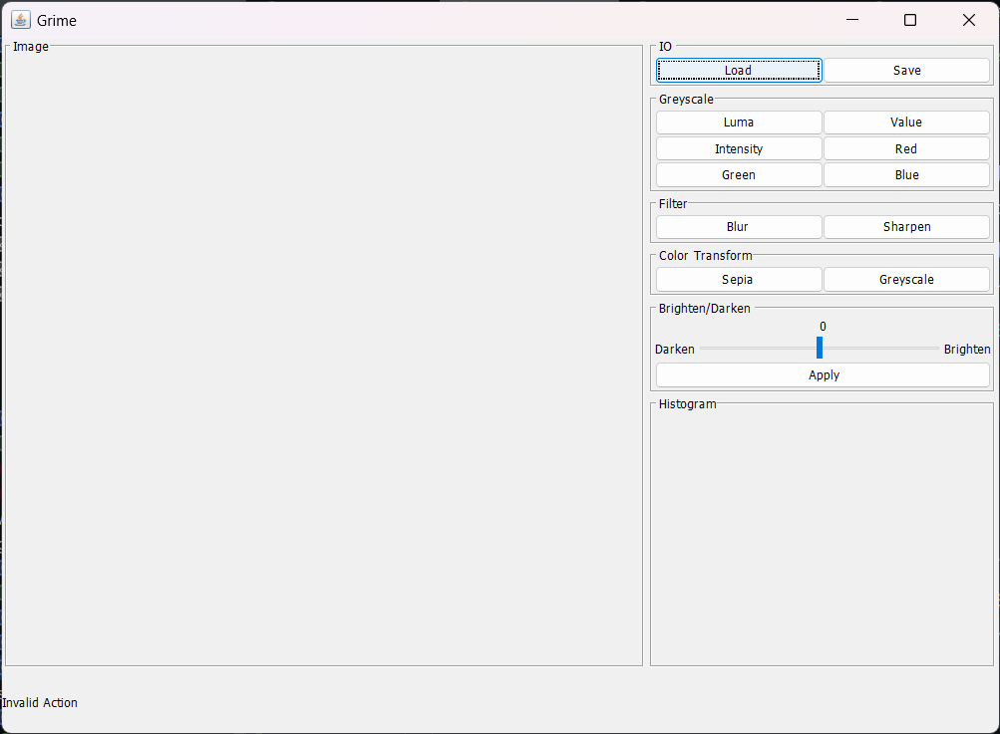
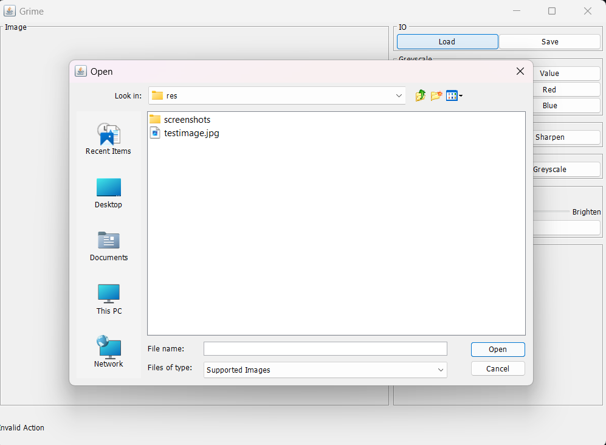
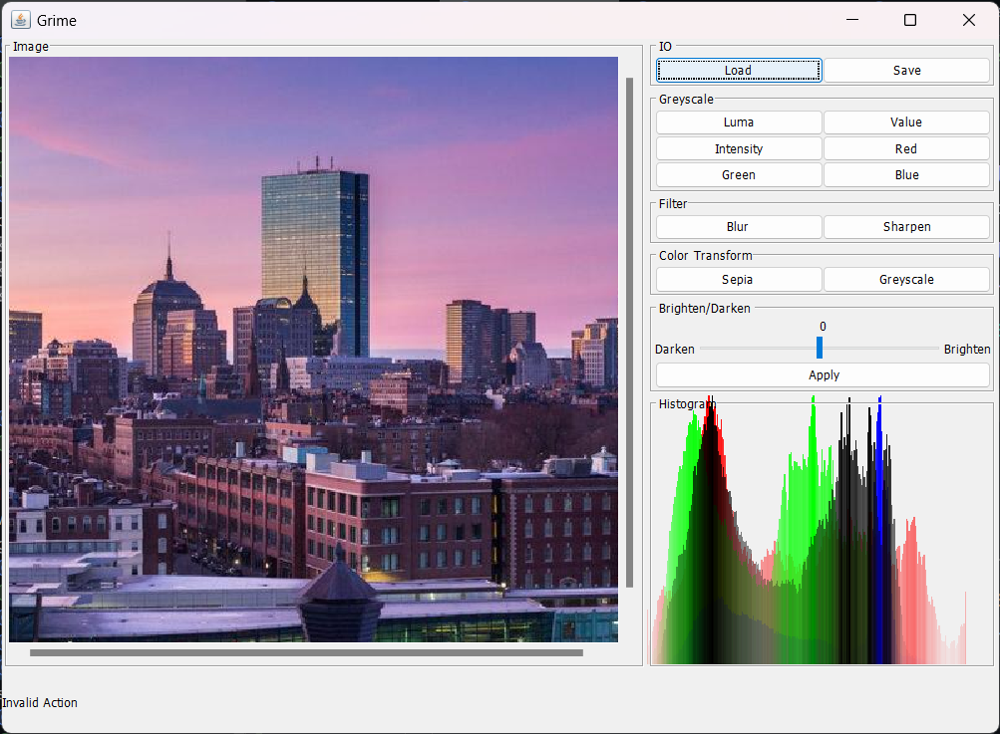
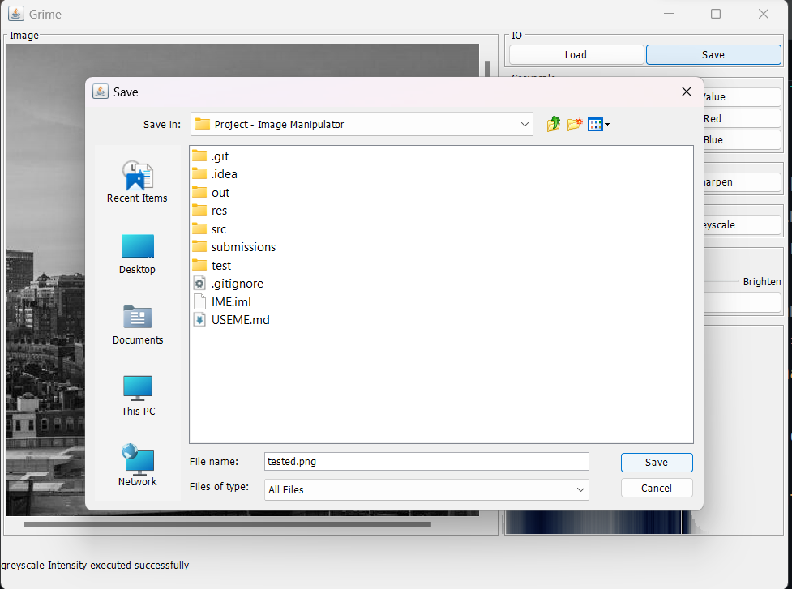
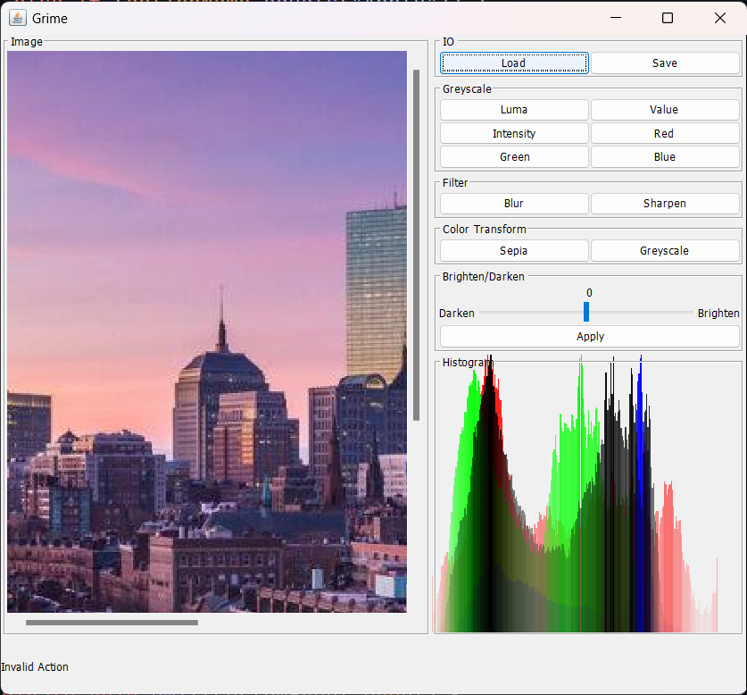
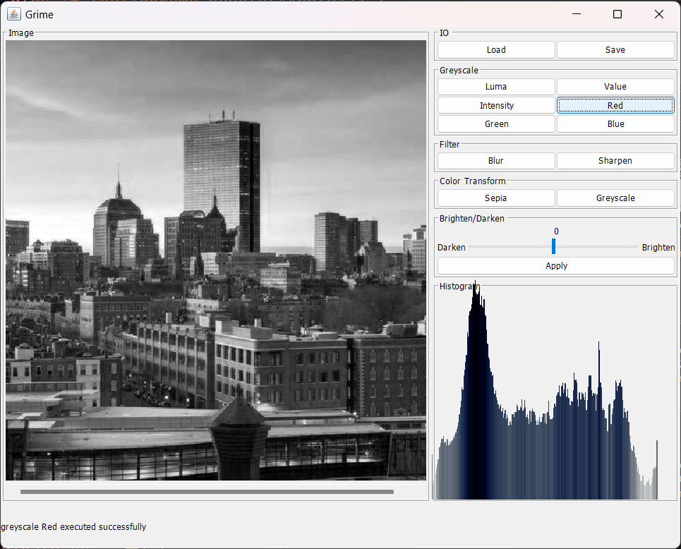
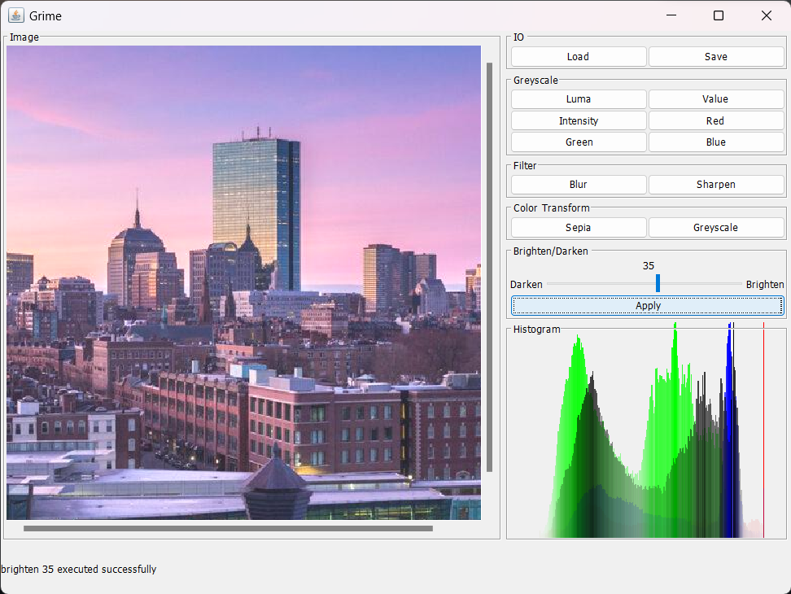
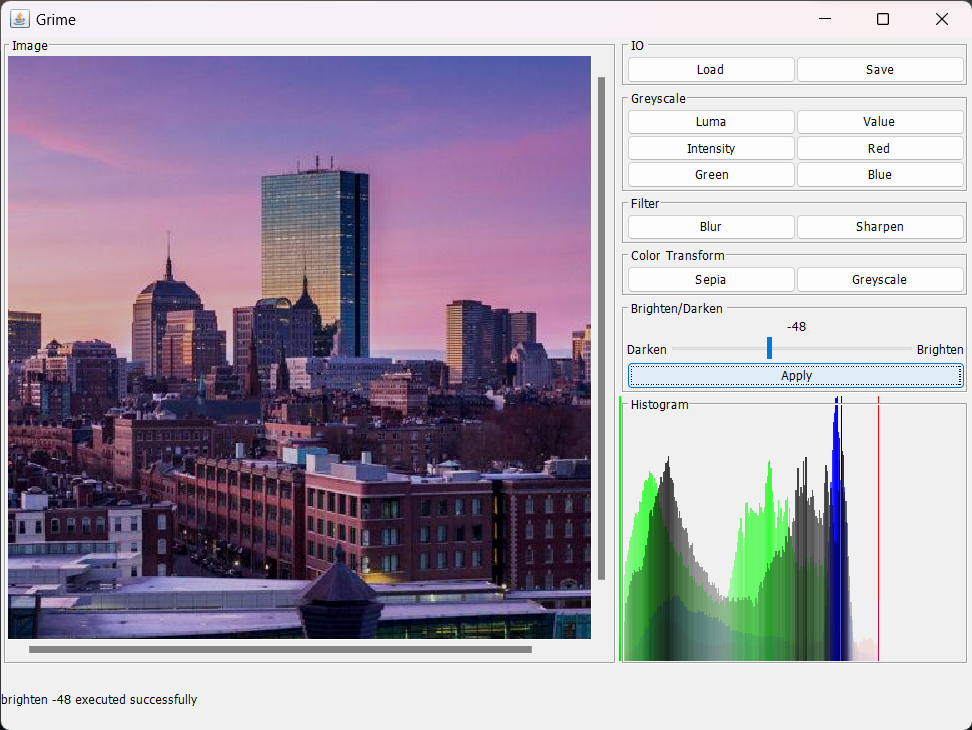
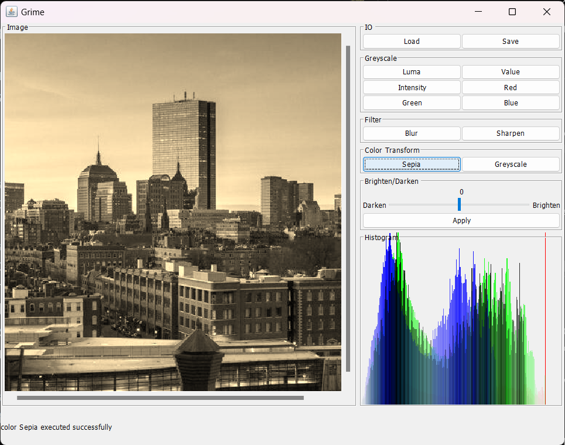

## Table of Contents

- [Overview](#overview)
- [GUI Useme](#gui-useme)
  - [Image Loading and Saving](#image-loading-and-saving)
    - [Loading an Image](#loading-an-image)
    - [Saving an Image](#saving-an-image)
  - [Image Viewing](#image-viewing)
    - [Scrolling](#scrolling)
    - [Zooming](#zooming)
  - [Image Processing Operations](#image-processing-operations)
    - [Grayscale Conversion](#grayscale-conversion)
    - [Brightness Adjustment](#brightness-adjustment)
    - [Color Transformation](#color-transformation)
    - [Filters](#filters)
    - [Histogram Vizualisation](#histogram-vizualisation)
- [Scripting Useme](#scripting-useme)
  - [Supported Commands](#supported-commands)

# Overview

Grime is an image processing application with a graphical user interface (GUI) that allows users to interactively load, process, and save images. It also supports batch scripting from the command line for advanced users. This document provides a guide on how to use the Grime GUI to perform various image processing operations.

The user can run the program with three types of command line arguments.

1.  `-file {file-path}` : Loads and runs commands from the specified file.
2. `-text` : Scripting Mode. Allows the user to enter commands manually. 
3. ` `(no argument) : GUI Mode. Opens the GUI for the user to interact with.

# GUI Useme

The GUI is divided into three main sections: the toolbar, the image display, and the histogram display. The toolbar contains the menu bar, which allows the user to load and save images, and perform image processing operations. The image display shows the current image, and the histogram display shows the histogram of the current image. The histogram display is updated in real time as the user modifies the image.

## Image Loading and Saving

### Loading an Image
1. Navigate to the "IO" in toolbar.
2. Select "Load" to load a file from your file system.
3. Choose the image file (PNG, PPM, BMP, JPEG or JPG) to process.
4. The image will be shown in the main window.

### Saving an Image

1. To save the current image, go to "Save" in the toolbar
2. Choose a file type (PNG, PPM, BMP, JPEG or JPG) and a target directory.
3. To save the image, click the "Save" button.

## Image Viewing

### Scrolling 
To scroll the image, use the scroll bars on the right and bottom of the image display. The scroll bars will appear when the image is larger than the display area.

### Zooming
To zoom in or out of the image, use the mouse wheel. The image will be zoomed in or out at the location of the mouse cursor.

## Image Processing Operations

### Grayscale Conversion

1. In the toolbar, find the "Grayscale" menu.
2. Select the desired component from the Grayscale submenu: luma, intensity, value, red, green, or blue.
3. A new grayscale image will be displayed.
   
  
### Brightness Adjustment
1. In the toolbar, find the "Brighten/Darken" menu.
2. Adjust the slider to the desired brightness level.
3. Move to the left (< 0) to darken the image, and to the right (> 0) to brighten the image.
4. Click the "Apply" button to apply the brightness adjustment.
   
   

### Color Transformation
1. In the toolbar, find the "Color" menu.
2. Click the desired color transformation from the Color submenu: sepia or greyscale.
3. A new color-transformed image will be displayed.
     

### Filters
1. In the toolbar, find the "Filters" menu.
2. Click on the desired filter from the Filters submenu: blur or sharpen.
3. A new filtered image will be displayed.

### Histogram Vizualisation
1. In the toolbar, find the "Histogram" panel.
2. As you modify the image, the histogram will be updated to reflect the changes in real time.
3. The histogram will be displayed in RGB color space.

# Scripting Useme

Scripting mode can be used to run a sequence of commands from a file or manually entered by the user. The user can run the program with the `-text` command line arguments to enter scripting mode. 

## Supported Commands

Below are the supported commands:

- `load {format} {image-path} {custom-Image-name}`
  Loads the image from the specified path and stores it with the given name.
    1. `ppm`: PPM format
    2. `jpg`: JPG format
    3. `png`: PNG format
    4. `bmp`: BMP format
- `save {format} {output-file-path} {customImage-name}`
  Saves the image with the specified name to the provided path in the given format.
    1. `ppm`: PPM format
    2. `jpg`: JPG format
    3. `png`: PNG format
    4. `bmp`: BMP format
- `greyscale {component} {customImage-name} {new-customImage-name}`
  Converts the custom image to greyscale using the chosen component:
    1. `red`: Red component
    2. `green`: Green component
    3. `blue`: Blue component
    4. `luma`: Luma component
    5. `value`: Value component
    6. `intensity`: Intensity component

- `brighten {value} {image-name} {new-customImage-name}`
  Brightens or darkens the custom image by the specified value.

- `filter {filter-type} {customImage-name} {new-customImage-name}`
  Applies the specified filter to the custom image:
    1. `blur`: Blurs the image
    2. `sharpen`: Sharpens the image

- `color {filter-type} {customImage-name} {new-customImage-name}`
  Applies the specified color filter to the custom image:
    1. `sepia`: Sepia filter
    2. `greyscale`: Greyscale filter

- `exit`
  Exits the program.

- `list-all-commands`
  Displays all available commands.

- `list-all-images`
  Displays a list of all loaded images.