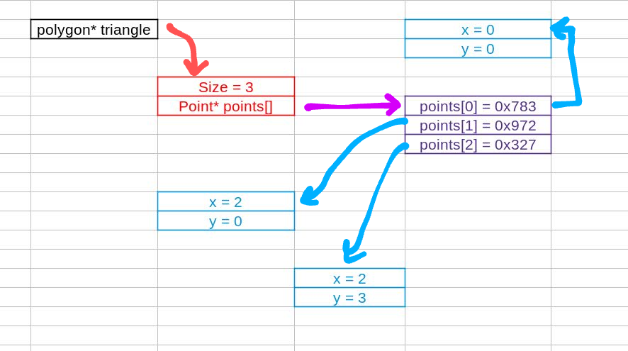
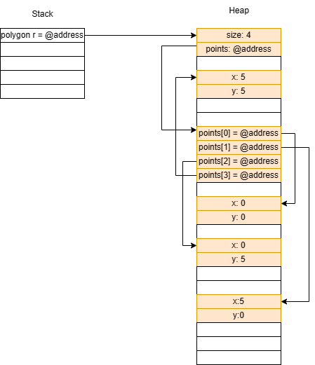

# Homework 2 Readme
Name:
`Pranchal Shah`

Github Account name:
`cyber-shah`

Link to Assignment on Github:
https://github.com/Su23-CS5008-Online-Lionelle/homework-02-cyber-shah

How many hours did it take you to complete this assignment (estimate)? 
`10 hours`

Did you collaborate with any other students/TAs/Professors? If so, tell us who and in what capacity.  
- one per row, add more if needed


Did you use any external resources (you do not have to cite in class material)? (Cite them below)  
- one row per resource


(Optional) What was your favorite part of the assignment? 
> Working with pointers! I think I understand pointers way better now.

(Optional) How would you improve the assignment?
> I think the assignment was great, I don't have any suggestions for improvement.

## Understanding C Questions

1. What is the difference between a variable and a pointer?
>  A variable stores a value directly in its allocated memory space, while a pointer stores the memory address of another variable.
> Variables can be used to directly access and manipulate data, whereas pointers allow for indirection and indirect access to data through the memory address.
2. In your test file, we had the following code:
    
    ```c
    int* arr = create_array_of_ints_fib(5);
    int expected[] = {1, 1, 2, 3, 5};
    ```
    Later in the code we only `free(arr)` but not expected. Why is this? What is the difference in where they are stored in memory?
>  This is because inside the function ```create_array_of_ints_fib()``` memory for the array was dynamically allocated on the heap, this memory is not freed up automatically. Unlike memory on a Stack which is cleared once a function is done executing. Hence, it is important to free up the memory allocated on the heap, using ```free(arr)```.
3. What is the difference between the heap and stack when related to memory allocation and management?
>  memory allocation : memory on the stack is allocated automatically when a function is called, and is freed up automatically when the function is done executing. Memory on the heap is allocated using ```malloc()``` and is not freed up automatically, it has to be freed up manually using ```free()```.

>  memory management : memory on the stack is managed automatically by the compiler, whereas memory on the heap has to be managed manually by the programmer.

>  anything stored on a stack is temporary, whereas anything stored on a heap is permanent.
4. When you use `malloc`, where are you storing the information?
>  There are two areas of memory - stacks and heaps. When we use ```malloc()``` we are storing the information on the heap.
5. Speaking about `malloc` and `calloc`, what is the difference between the two (you may need to research it!)?
>  ```malloc()``` allocates memory on the heap, but does not initialize the memory. ```calloc()``` allocates memory on the heap and initializes the memory to zero.
6. What are some common built in libraries used for C, list at least 3 and explain each one in your own words. Name a few functions in those libraries (hint: we used two of the most common ones in this assignment. There are many resources online that tell you functions in each library)?
>  1. ```stdio.h``` - this library is used for input and output operations. It contains functions like ```printf()``` and ```scanf()```. 
>  2. ```stdlib.h``` - this library is used for memory allocation and management. It contains functions like ```malloc()``` and ```free()```.
>  3. ```string.h``` - this library is used for string manipulation. It contains functions like ```strlen()``` and ```strcpy()```.
> 
7. Looking at the struct Point and Polygon, we have a mix of values on the heap, and we make ample use of pointers. Take a moment to draw out how you think that looks after `create_triangle(2,3)` is called (see an example below). The important part of the drawing it to see that not everything is stored together in memory, but in different locations! Store the image file in your github repo and link it here. You can use any program to draw it such as [drawIO](https://app.diagrams.net/), or even draw it by hand and take a picture of it.
   


### Linking to images?
To link an image, you use the following code

```markdown

```
for example
```markdown

```


Here is a sample using: 
```c
void my_func() {
    Polygon* r = create_rectangle(5,5);
    printf("The area of the rectangle is %d\n", area(r));
}
```


Note: This is a simplified version. However, it helps illustrate why we need to use `free` on the pointers in the struct. If we do not, we will have memory leaks! (memory that is allocated, but not freed, and thus cannot be used by other programs). In the above example code, `r` is created, and then the variable is destroyed when the function ends. However, the memory allocated for the struct is not freed, and thus we have a memory leak.

When you work on your version for `create_triangle(2, 3)`, you do not have to be exact on the memory structure (the locations on the heap were randomly chosen). The idea is more to show how the memory is stored, and the pointers to different memory addresses. 

