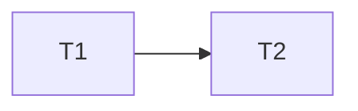
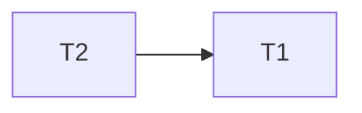
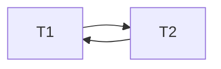
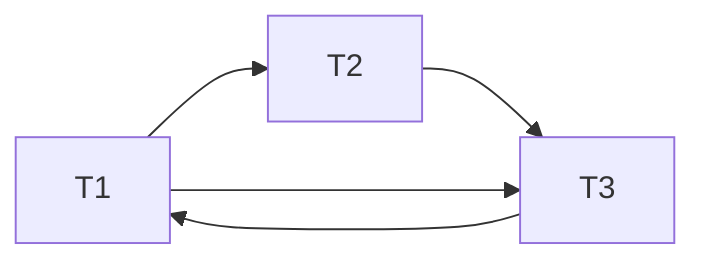
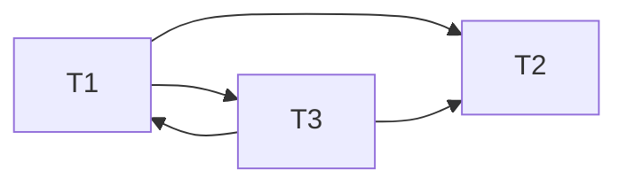
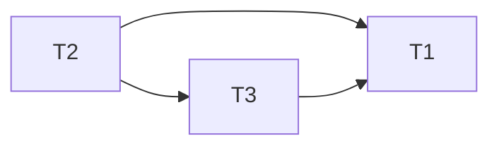
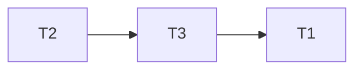
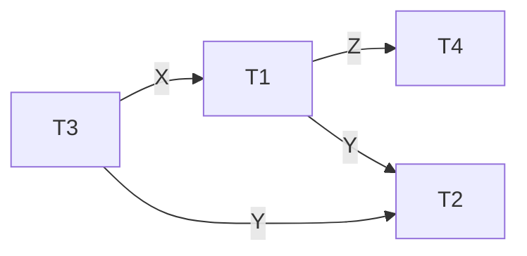

# Q1 : Schedules
#### S01 : T1 -> T2
| Transaction 1 | Transaction 2 |
|----------------|----------------|
| READ(X)        |                |
|  X = X - N       |                |
| WRITE(X)       |                |
| Commit         |          |
|                | READ(X)        |
|                | X = X +M        |
|                | WRITE(X)       |
|          |        Commit  |

#### S02: T2 -> T1
| Transaction 1 | Transaction 2 |
|----------------|----------------|
|                | READ(X)        |
|                | X = X + M        |
|                | WRITE(X)       |
|          | Commit         |
| READ(X)        |                |
|  X = X - N       |                |
| WRITE(X)       |                |
| Commit         |          |

#### S03: 
| Transaction 1 | Transaction 2 |
|----------------|----------------|
|                | READ(X)        |
| READ(X)        |                |
|                | X = X + M        |
|                | WRITE(X)       |
|          | Commit         |
|  X = X - N       |                |
| WRITE(X)       |                |
| Commit         |          |

#### S04: 
| Transaction 1 | Transaction 2 |
|----------------|----------------|
| READ(X)        |                |
|                | READ(X)        |
|  X = X - N       |                |
| WRITE(X)       |                |
| Commit         |          |
|                | X = X + M        |
|                | WRITE(X)       |
|          | Commit         |

#### Conflict Serializable schedules
S03 and S04 as they contain cycles.

# Q2 Precedence Graphs

### Schedule 1

### Schedule 2

### Schedule 3

# Q3 Serial Schedule 
The only schedule which does not have a cycle in its precedence graph is Schedule 3.
And the serial schedule is:

All other schedules contain a cycle in their graphs and hence are not conflict serializable.

# Q4 - WFGs

# Q5 - Deadlocks

| Time | T1              | T2         |
|------|-----------------|------------|
| t1   |                 |            |
| t2   | Lock(X)         |            |
| t3   |                 | Lock(Y)    |
| t4   |                 |            |
| t5   |                 |            |
| t6   | Lock(Y) (wait)  |            |
| t7   |   |           Lock(X) (wait) |

At time t6, T1 is waiting for the lock on Y held by T2, and at time t7, T2 is waiting for the lock on X held by T1. This mutual waiting results in a deadlock, as each transaction is holding a lock that the other needs.

#### Issue
- At time t6, T1 holds a lock on X and is requesting a lock on Y.
- Simultaneously, at time t7, T2 holds a lock on Y and is requesting a lock on X.
- Neither transaction can proceed, as each is waiting for the other to release a lock on an item it holds.

#### Resolution
- To resolve the deadlock, the DBMS must recognize the deadlock situation.
- One way to break the deadlock is to abort one or more of the transactions.
- In this case, the DBMS might decide to abort either T1 or T2.
- The aborted transaction's changes need to be undone to maintain consistency.
- Once aborted, the locks held by the aborted transaction are released, allowing the other transaction to proceed.

# Q6 - Basic vs Thomas' Rule

### **Concurrency Control Protocol:**
- Orders transactions based on timestamps, with older transactions (smaller timestamps) getting priority in the event of conflicts.
- Transactions are executed in chronological order of timestamps, ensuring conflict serializability
#### **Read Operation:**
- If a transaction T attempts to read a data item (x), it can proceed only if ts(T) > write_timestamp(x).
- If ts(T) ≤ write_timestamp(x), T is aborted and restarted with a new timestamp.
#### **Write Operation:**
- If a transaction T attempts to write a data item (x):
    - If ts(T) ≤ read_timestamp(x), T is aborted and restarted with a new timestamp.
    - If ts(T) ≤ write_timestamp(x), T is aborted and restarted with a new timestamp.
    - Otherwise, the write operation proceeds, and write_timestamp(x) is set to ts(T).

###  Thomas' Write Rule Timestamping Algorithm:
#### **Modification to Basic Algorithm:**
- Thomas' write rule relaxes conflict serializability to provide greater concurrency.
- Ignores obsolete write operations to allow more concurrent schedules.
#### **Write Operation Modification:**
- If ts(T) ≤ read_timestamp(x), T is aborted and restarted with a new timestamp.
- If ts(T) ≤ write_timestamp(x), the write operation is ignored (no rollback), and write_timestamp(x) is not updated.
- Otherwise, the write operation proceeds, and write_timestamp(x) is set to ts(T).

###  Differences:
1. **Concurrency Guarantee:**
    - Basic Timestamping: Guarantees conflict serializability, ensuring equivalent results to a serial schedule.
    - Thomas' Write Rule: Relaxes conflict serializability, allowing more concurrent schedules by ignoring certain obsolete write operations.
2. **Handling Write Operations:**
    - Basic Timestamping: Aborts and restarts transactions attempting to write if conflicts occur.
    - Thomas' Write Rule: Ignores certain obsolete write operations, allowing transactions to proceed without rollback in some cases.
3. **Concurrency Trade-Off:**
    - Basic Timestamping: Provides a stricter guarantee of serializability but with potentially less concurrency.
    - Thomas' Write Rule: Allows for greater concurrency by relaxing conflict serializability under specific conditions.

# Q7 - Time Stamps

Let’s apply the basic timestamping algorithm to the given schedule. We’ll assume that the transaction id issued to the latest transaction is 20, and transactions A, B, and C have ids 21, 22, and 23 respectively.

TIME | T(A) | T(B) | T(C) | read(X) | write(X) | read(Y) | write(Y) | read(Z) | write(Z)
-----|---------------|---------------|---------------|------------|-------------|------------|-------------|------------|-------------
11   |               | READ(Z)       |               | 20         | 20          | 20         | 20          | 22         | 20
12   |               | READ(Y)       |               | 20         | 20          | 22         | 20          | 22         | 20
13   |               | WRITE(Y)      |               | 20         | 20          | 22         | 22          | 22         | 20
14   |               |               | READ(Y)       | 20         | 20          | 23         | 22          | 22         | 20
15   |               |               | READ(Z)       | 20         | 20          | 23         | 22          | 23         | 20
16   | READ(X)       |               |               | 21         | 20          | 23         | 22          | 23         | 20
17   | WRITE(X)      |               |               | 21         | 21          | 23         | 22          | 23         | 20
18   |               |               | WRITE(Y)      | 21         | 21          | 23         | 23          | 23         | 20
19   |               |               | WRITE(Z)      | 21         | 21          | 23         | 23          | 23         | 23
20   |               | READ(X)       |               | 22         | 21          | 23         | 23          | 23         | 23
21   | READ(Y)       |               |               | 22         | 21          | 21         | 23          | 23         | 23
22   | WRITE(Y)      |               |               | 22         | 21          | 21         | 21          | 23         | 23
23   |               | WRITE(X)      |               | 22         | 22          | 21         | 21          | 23         | 23

- At time 14, Transaction C (timestamp 23) tries to read Y which was last written by Transaction B (timestamp 22). This is allowed as 23 > 22.
- At time 18, C tries to write on Y, which is allowed as it was written by B previously, and 23>22.
- At time 20, Transaction B (timestamp 22) tries to read X which was last written by Transaction A (timestamp 21). This is allowed as 22 > 21.
- At time 21, Transaction A (timestamp 21) tries to read Y which was last written by Transaction C (timestamp 23). This is not allowed as 21 < 23. So, Transaction A needs to be restarted.
Therefore Transaction A needs to restart. Due to the rule stated above "ts(T) ≤ write_timestamp(x), T is aborted and restarted with a new timestamp."

# Q8: Recovery Logs 🪵
In the log we can see that there are two committed transactions before the system failure/crash, and there were two active transactions:

| Committed Transactions | Incomplete Transactions |
| -------------------- | ----------------------- |
| T1 | T2 |
| T4 | T3 |

For recovery we need to rollback all incomplete transactions since they did not finish/commit before failure. Plus, redo all completed transactions to ensure that they update the database.

Therefore we Undo and Redo the following transactions:

| Redo | Undo |
| -------------------- | ----------------------- |
| T1 | T2 |
| T4 | T3 |

There are no cascading rollbacks in this scenario as all committed transactions have no interference by the incomplete ones.

# Q9: Cascading Rollback 🧻
Cascading rollback refers to a situation where the failure of one transaction leads to the rollback of other transactions that have dependencies on it. This can result in a chain reaction where multiple transactions are rolled back, undoing a significant amount of work. Cascading rollbacks are undesirable as they can lead to increased system overhead and reduced performance.
#### **Example Schedule:**
| Transaction T1            | Transaction T2           | Transaction T3         |
|-----------------------------|-----------------------------|-----------------------------|
| write_lock(X)    |                             |                             |
| READ(X)    |                             |                             |
| WRITE(X) |                             |                             |
| unlock(X) |                             |                             |
|                             | write_lock(X) |                             |
|                             | READ(X)|                             |
|                             | WRITE(X)|                             |
|                             | unlock(X)|                             |
|                             |                             | write_lock(X)|
|                     |                             | READ(X)|
|                     |                     | WRITE(X)|
|                             |                             | unlock(X)|
|       rollback                      |                             | |
|                             |              rollback               | |
|                             |                             | rollback|

**Schedule:**
- T1 writes to and releases the lock on item X.
- T2 reads and writes to X and releases the lock.
- T3 reads and writes to X and releases the lock.
- A failure occurs in T1 (rollback).
- The cascading effect begins: T2, which has already committed, needs to be rolled back due to the dependency on the rolled-back T1.
- Subsequently, T3, which has already committed, also needs to be rolled back due to the dependency on the rolled-back T2.

**Issue:**
- The failure in T1 triggers a cascading rollback, causing the undoing of committed work in T2 and T3.

# Q10 : Recoverable
The schedule is recoverable because:
1. **T3 and T2 don't write anything:**
	- Since T2 and T3 don't perform any write operations, they do not have any impact on the recoverability of the schedule. In the context of recoverability, it is mainly concerned with write operations.
2.  **T2 reads after T1 writes, T3 reads before T3 writes:**
	- The read operation of T2 on item X occurs after T1 has committed its write operation on X. 
	- Similarly, the read operation of T3 on item X occurs before T3 writes to X. 
	- This ensures that both T2 and T3 read consistent values, contributing to the recoverability of the schedule.