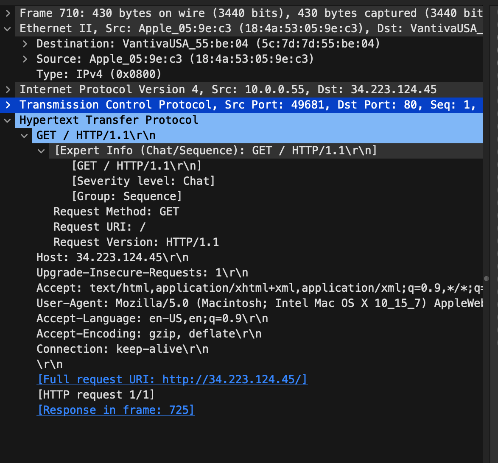
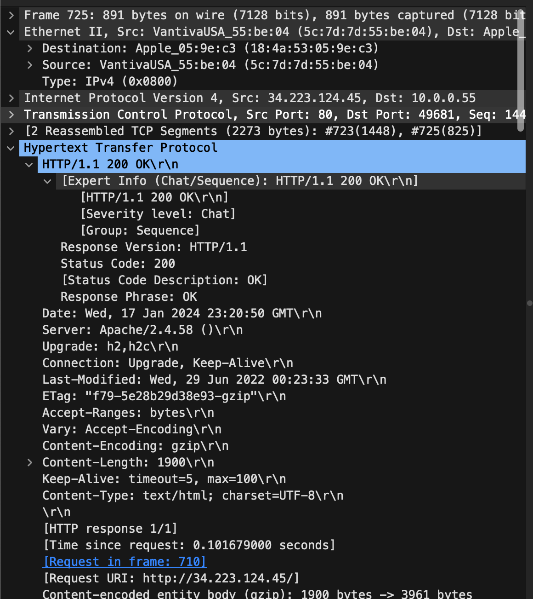
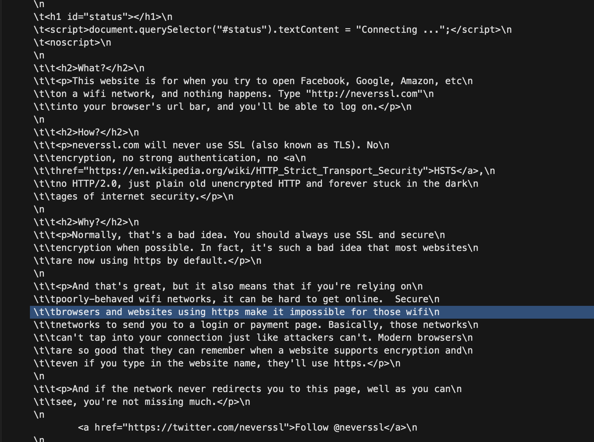
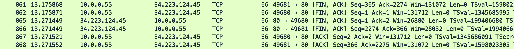

# Q1.  Internet working

For this assignment I decided to use a website that doesn't serve HTTPS by default. The reason being I wanted to see how HTTP data can be intercepted and modified. I used the website 
```neverssl.com```. 

## 1.1 DNS lookup

The first step in the process is to resolve the domain name to an IP address. This is done by querying a DNS server. The DNS server is specified in the network settings of the computer. In my case, the DNS server is ```comcast.net```. The DNS server is queried using the ```dig``` command. The command is shown below:

```dig neverssl.com```

The output of the command is shown below:

```
; <<>> DiG 9.10.6 <<>> neverssl.com
;; global options: +cmd
;; Got answer:
;; ->>HEADER<<- opcode: QUERY, status: NOERROR, id: 11543
;; flags: qr rd ra; QUERY: 1, ANSWER: 1, AUTHORITY: 0, ADDITIONAL: 1

;; OPT PSEUDOSECTION:
; EDNS: version: 0, flags:; udp: 512
;; QUESTION SECTION:
;neverssl.com.			IN	A

;; ANSWER SECTION:
neverssl.com.		60	IN	A	34.223.124.45

;; Query time: 153 msec
;; SERVER: 2001:558:feed::1#53(2001:558:feed::1)
;; WHEN: Wed Jan 17 18:48:20 EST 2024
;; MSG SIZE  rcvd: 57
```

Then I did a reverse DNS lookup to find the domain name of the IP address. 
``` dig -x 2001:558:feed::1 ```

Therefore, the DNS server responds with the IP address of the website. In this case the IP address is for neverSSL.com is ```34.223.124.45```

## 1.2 TCP connection
Once the IP address is known, the client initiates a TCP connection with the server. I used a browser to connect to the IP address and wire shark to capture the packets. The packets are shown below:


### 1.2.1 TCP handshake
1. Source sends a SYN packet to the destination's IP address and port.
2. The source continues sending SYN packets until the destination replies with a SYN-ACK packet with the acknowledgment number set to 1.
    - It keeps sending SYN packets until it receives a SYN-ACK packet from the destination.
   - We can see that the source sends 2 SYN packets before receiving a SYN-ACK packet.
3. Source responds with an ACK packet, establishing the TCP connection.
4. Destination sends another SYN-ACK packet.
5. Source sends an ACK packet, finalizing the TCP handshake.


# 1.3 HTTP request
Once the TCP connection is established, the client sends an HTTP request to the server. The HTTP request is shown below:

### 1.2.2 HTTP request
1. Source sends an HTTP GET request to the destination, specifying the desired resource (e.g., /index.html).
2. Destination acknowledges the request with an ACK packet.



### 1.2.3 HTTP response
1. Destination sends an HTTP response with the requested resource.
2. Source acknowledges the response with an ACK packet
   
3. A snapshot of the HTTP sent by the destination is shown below:
    


## 1.4 TCP connection termination
Once the HTTP response is received, the client terminates the TCP connection. The packets are shown below:


### 1.3.1 TCP connection termination
1. Source sends a FIN, ACK packet to the destination.
2. Destination acknowledges the FIN, ACK packet with an ACK packet.

