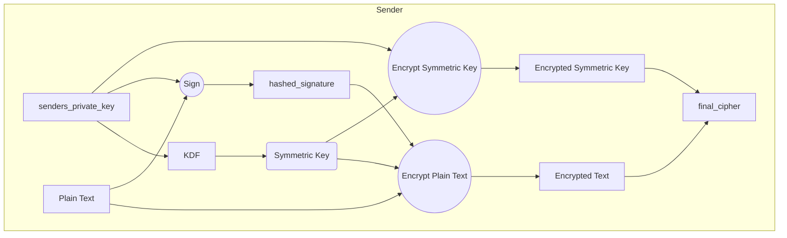
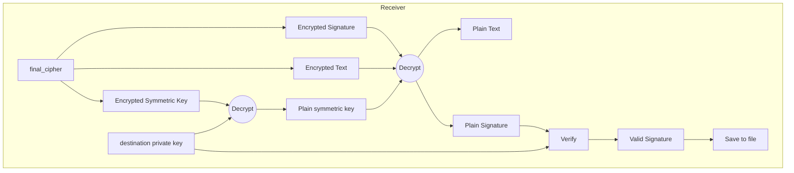

CS 6740
Pranchal Shah

## PS 2 : Crypto

## Design:
The design of the program is as follows:
1. The program works as a mix of asymmetric and symmetric encryption.
2. The sender creates an symmetric encryption key using KDF function, with their secret key as the password.
3. The symmetric key is then used to encrypt the the plaintext.
4. Sender encrypts the symmetric key using the receiver's public key.
5. Sender sends the encrypted symmetric key, the encrypted message and the signature to the receiver.
6. Receiver decrypts the symmetric key using their private key.
7. Receiver decrypts the message using the symmetric key.
8. Later the receiver verifies the signature using the sender's public key.
9. If the signature is valid, the decrypted message is saved to the specified file path.

## Encryption:

### Creating symmetric key:
Symmetric key is dervied using KDF function implemented using PBKDF2HMAC. Password Based Key Derivation Function 2
The key is derived using the following parameters:
Because this is a password based key derivation function - making it ideal for creating a symmetric key from a password (sender's private key)

1. Hash function: SHA256
2. Key length: 32 bytes
3. Salt: A random 16 byte string
4. Iterations: 100000
this is later used to derive the key from sender's private key.

### Creating signature:
The senders private key is used to sign the message. Which can later be verified using the sender's public key. Using PSS padding. The signature is created using the following parameters:
1. Hash function: SHA256
2. Mask generation function: MGF1
3. Salt length: Maximum PSS length

Maximum PSS length is used because it is the most secure option. 

### Encrypting the message:
The message is encrypted using AES in CBC mode, using symmetric key. Its padded with PKCS7 padding. The key is encrypted using the following parameters:
1. Mode: CBC
2. IV size: 16 bytes
3. Padding: PKCS7

We use AES and CBC mode because it is a widely used and secure symmetric encryption algorithm. CBC mode is used because it is secure and allows for parallelization. 

### Encrypting symmetric key:
The symmetric key is encrypted using the receiver's public key. The key is encrypted using RSA OAEP padding. The key is encrypted using the following parameters:
1. Hash function: SHA256
2. Mask generation function: MGF1
3. Padding: OAEP
4. Label: None
5. Final key size: 128 bytes

OEAP is used here because it allows for creating keys based on password which makes it ideal for this use case, where the symmetric key is derived from the sender's private key.

### Creating final cipher
The final cipher is created by concatenating the encrypted symmetric key, encrypted message and the signature. This is later used by the receiver to decrypt the message.

## Decryption:

### Breaking the final cipher:
The final cipher is broken into three parts, the encrypted symmetric key, encrypted message and the signature. This process of breaking the cipher is done using the following parameters:
1. Encrypted symmetric key size: 128 bytes
    - The message is encrypted using AES in CBC mode, using symmetric key. 
2. Encrypted signature size: 128 bytes
   -  The signature is verified using the sender's public key. If the signature is valid, the message is saved to the specified file path.
3. Encrypted message size: Remaining bytes 
    - The message is decrypted using the symmetric key.

