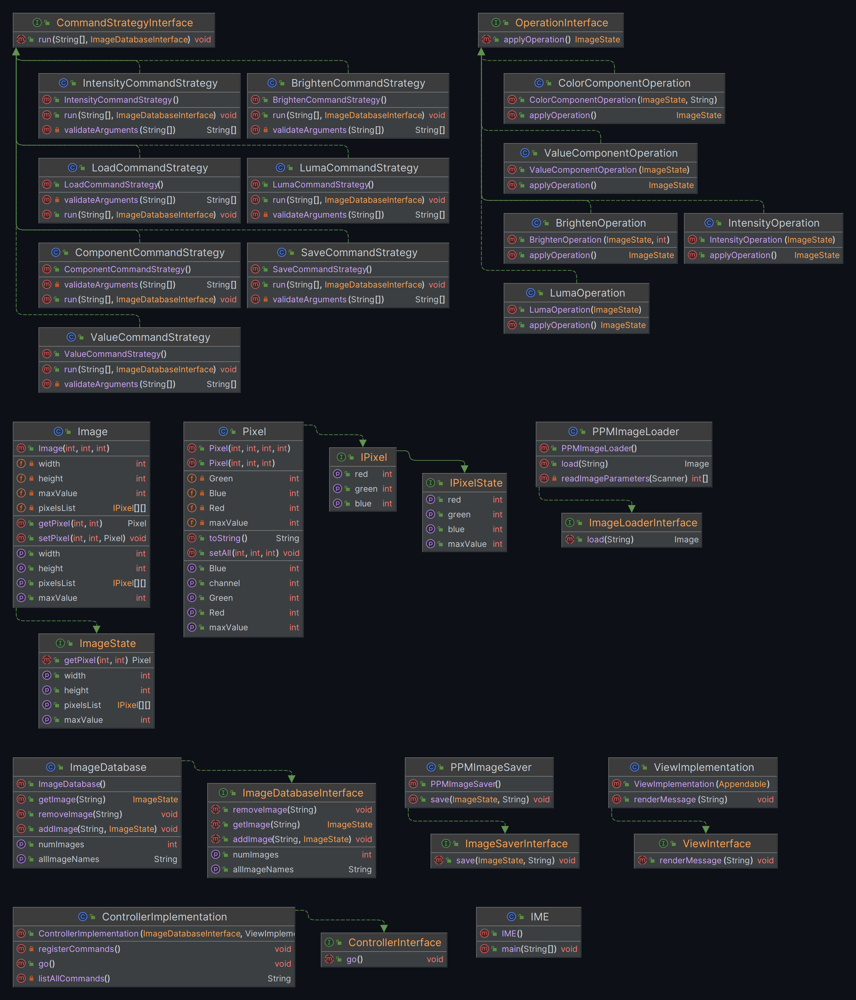

# IME - Image Manipulation Program

## Description

This program is a command line image manipulation program. It allows the user to load, save, and manipulate images. The program supports the following commands:
- load  <image-path> <image-name>
- save  <output-file-path> <image-name> 
- component <red|green|blue> <image-name> <new-image-name>
- luma <image-name> <new-image-name>
- value <image-name> <new-image-name>
- intensity <image-name> <new-image-name>
- brighten <value ><image-name> <new-image-name>
  (also supports darkening with negative values)
- exit
- list-all-commands
- list-all-images

## Design
The design follows Model View Controller (MVC) architecture. The model is the ImageDatabase, which stores all the images. The view is the ViewImplementation, which is responsible for displaying messages to the user. The controller is the ControllerImplementation, which is responsible for parsing user input and calling the appropriate methods in the model and view. The controller also contains the main method, which is responsible for initializing the model, view, and controller, and starting the program.

>The system follows a Command pattern for executing image processing commands.
>It uses the Strategy pattern to execute the operations.

The usage of command pattern and strategy pattern allows for easy extensibility of the program. 
New commands can be added by creating a new class that implements the CommandStrategyInterface. 
New operations can be added by creating a new class that implements the OperationInterface. 
These new command and operation can then be added to the controller and used in the program.

The design can be seen in the following UML diagram:

```mermaid
classDiagram
direction BT
class BrightenCommandStrategy {
+ BrightenCommandStrategy()
+ run(String[], ImageDatabaseInterface) void
- validateArguments(String[]) String[]
  }
  class BrightenOperation {
+ BrightenOperation(ImageState, int)
+ applyOperation() ImageState
  }
  class ColorComponentOperation {
+ ColorComponentOperation(ImageState, String)
+ applyOperation() ImageState
  }
  class CommandStrategyInterface {
  <<Interface>>
+ run(String[], ImageDatabaseInterface) void
  }
  class ComponentCommandStrategy {
+ ComponentCommandStrategy()
- validateArguments(String[]) String[]
+ run(String[], ImageDatabaseInterface) void
  }
  class ControllerImplementation {
+ ControllerImplementation(ImageDatabaseInterface, ViewImplementation, Readable)
- registerCommands() void
+ go() void
- listAllCommands() String
  }
  class ControllerInterface {
  <<Interface>>
+ go() void
  }
  class IME {
+ IME()
+ main(String[]) void
  }
  class IPixel {
  <<Interface>>
  int red
  int green
  int blue
  }
  class IPixelState {
  <<Interface>>
  int red
  int green
  int blue
  int maxValue
  }
  class Image {
+ Image(int, int, int)
- int width
- int height
- int maxValue
- IPixel[][] pixelsList
+ getPixel(int, int) Pixel
+ setPixel(int, int, Pixel) void
  int width
  int height
  IPixel[][] pixelsList
  int maxValue
  }
  class ImageDatabase {
+ ImageDatabase()
+ getImage(String) ImageState
+ removeImage(String) void
+ addImage(String, ImageState) void
  int numImages
  String allImageNames
  }
  class ImageDatabaseInterface {
  <<Interface>>
+ removeImage(String) void
+ getImage(String) ImageState
+ addImage(String, ImageState) void
  int numImages
  String allImageNames
  }
  class ImageLoaderInterface {
  <<Interface>>
+ load(String) Image
  }
  class ImageSaverInterface {
  <<Interface>>
+ save(ImageState, String) void
  }
  class ImageState {
  <<Interface>>
+ getPixel(int, int) Pixel
  int width
  int height
  IPixel[][] pixelsList
  int maxValue
  }
  class IntensityCommandStrategy {
+ IntensityCommandStrategy()
+ run(String[], ImageDatabaseInterface) void
- validateArguments(String[]) String[]
  }
  class IntensityOperation {
+ IntensityOperation(ImageState)
+ applyOperation() ImageState
  }
  class LoadCommandStrategy {
+ LoadCommandStrategy()
- validateArguments(String[]) String[]
+ run(String[], ImageDatabaseInterface) void
  }
  class LumaCommandStrategy {
+ LumaCommandStrategy()
+ run(String[], ImageDatabaseInterface) void
- validateArguments(String[]) String[]
  }
  class LumaOperation {
+ LumaOperation(ImageState)
+ applyOperation() ImageState
  }
  class OperationInterface {
  <<Interface>>
+ applyOperation() ImageState
  }
  class PPMImageLoader {
+ PPMImageLoader()
+ load(String) Image
- readImageParameters(Scanner) int[]
  }
  class PPMImageSaver {
+ PPMImageSaver()
+ save(ImageState, String) void
  }
  class Pixel {
+ Pixel(int, int, int, int)
+ Pixel(int, int, int)
- int Green
- int Blue
- int Red
- int maxValue
+ toString() String
+ setAll(int, int, int) void
  int Blue
  int channel
  int Green
  int Red
  int maxValue
  }
  class SaveCommandStrategy {
+ SaveCommandStrategy()
+ run(String[], ImageDatabaseInterface) void
- validateArguments(String[]) String[]
  }
  class ValueCommandStrategy {
+ ValueCommandStrategy()
+ run(String[], ImageDatabaseInterface) void
- validateArguments(String[]) String[]
  }
  class ValueComponentOperation {
+ ValueComponentOperation(ImageState)
+ applyOperation() ImageState
  }
  class ViewImplementation {
+ ViewImplementation(Appendable)
+ renderMessage(String) void
  }
  class ViewInterface {
  <<Interface>>
+ renderMessage(String) void
  }

BrightenCommandStrategy  ..>  CommandStrategyInterface
BrightenOperation  ..>  OperationInterface
ColorComponentOperation  ..>  OperationInterface
ComponentCommandStrategy  ..>  CommandStrategyInterface
ControllerImplementation  ..>  ControllerInterface
IPixel  -->  IPixelState
Image  ..>  ImageState
ImageDatabase  ..>  ImageDatabaseInterface
IntensityCommandStrategy  ..>  CommandStrategyInterface
IntensityOperation  ..>  OperationInterface
LoadCommandStrategy  ..>  CommandStrategyInterface
LumaCommandStrategy  ..>  CommandStrategyInterface
LumaOperation  ..>  OperationInterface
PPMImageLoader  ..>  ImageLoaderInterface
PPMImageSaver  ..>  ImageSaverInterface
Pixel  ..>  IPixel
SaveCommandStrategy  ..>  CommandStrategyInterface
ValueCommandStrategy  ..>  CommandStrategyInterface
ValueComponentOperation  ..>  OperationInterface
ViewImplementation  ..>  ViewInterface 
```

### Model 
The model follows a Strategy pattern, where the ControllerImplementation class is the context, and the CommandStrategyInterface is the strategy.
The model contains the following packages:
1. Image package - Contains mainly two components: Image and Pixel. 
   * The Image class contains a 2D array of IPixel objects, which represent the pixels in the image. 
   The Image class also contains the width, height, and maxValue of the image. 
   The Image class also contains methods for getting and setting pixels in the image.  
   * It also contains the IPixel interface, which represents a pixel. 
   It contains the red, green, and blue values of the pixel. It also contains the IPixelState interface, which represents a pixel that cannot be modified. 
   It contains the red, green, and blue values of the pixel, as well as the maxValue of the image.
   > This follows the Liskov Substitution Principle because Image can be substituted for ImageState to make it unmodifiable.
Similarly, IPixel can be substituted for IPixelState to make it unmodifiable, wherever needed.
2. Operations package - contains the OperationInterface interface, which represents an operation on an image. 
It contains the applyOperation method, which applies the operation to the image and returns the resulting image. 
It also contains the IntensityOperation, BrightenOperation, LumaOperation, and ValueComponentOperation classes, which implement the OperationInterface interface. 
These classes represent the intensity, brighten, luma, and value operations, respectively.
    > This follows the Open-Closed Principle because new operations can be added by creating a new class that implements the OperationInterface interface.
3. ImageDatabase package - contains the ImageDatabase class, which implements the ImageDatabaseInterface interface.
It contains a map of image names to ImageState objects. 
It also contains the getImage, addImage, and removeImage methods, which get, add, and remove images from the database, respectively. 

### View
The view contains a ViewInterface interface and a ViewImplementation class. The ViewInterface interface contains a renderMessage function which renders Strings to the user. This method is used to render errors and sucessful command messages.

### Controller
The controller is primarily responsible for the following things:
1. Running the program
2. Parsing command line arguments
3. Calling the appropriate methods in the model
4. Calling the appropriate methods in the view
5. Catching exceptions and rendering error messages to the user.

The ControllerImplementation class contains a go method, which runs the program. The ControllerImplementation is responsible for parsing the command line arguments and calling the appropriate methods in the model. The ControllerInterface interface contains a go method, which runs the program. It also contains a listAllCommands method, which returns a string representation of all the commands in the program. 

Broadly there are two main packages in the controller:
1. CommandStrategy package - contains the CommandStrategyInterface interface, which represents a command strategy.
   * It contains all the methods that are accepted as command operations. These classes act as a intermediate between the controller and the model.
   They are responsible to parse the commands and pass them into the MODEL operations in whatever format needed.
   > This follows the Single Responsibility Principle as each class is responsible for only one type of command.
2. IO package - contains the two interfaces - ImageLoaderInterface and ImageSaverInterface.
   * The ImageLoaderInterface is then implemented by PPMImageLoader class which is responsible for loading the image from a PPM file.
   * The ImageSaverInterface is then implemented by PPMImageSaver class which is responsible for saving the image to a PPM file.
   > This follows the open closed principle as the controller is open for extension but closed for modification.
   > Which means that whenever we would need to add more image formats we can simply add more classes which implement the ImageLoaderInterface and ImageSaverInterface 
   > and the existing code would not need to be modified.

# Citation
1. [StackOverflow](https://stackoverflow.com/questions/74620396/how-to-convert-images-from-the-jpg-format-to-ppmp3) The image used for testing purposes is from StackOverflow and can be found here.
2. [GeeksforGeeks](https://www.geeksforgeeks.org/ood-principles-solid/) Principles of Object Oriented Design