# IME - Image Manipulation Program

## Description

This program is a command line image manipulation program. It allows the user to load, save, and manipulate images. The program supports the following commands:
- load  <image-path> <image-name>
- save  <output-file-path> <image-name> 
- component <red|green|blue> <image-name> <new-image-name>
- luma <image-name> <new-image-name>
- value <image-name> <new-image-name>
- intensity <image-name> <new-image-name>
- brighten <value ><image-name> <new-image-name>
  (also supports darkening with negative values)
- exit
- list-all-commands
- list-all-images

## Design
The design follows Model View Controller (MVC) architecture. The model is the ImageDatabase, which stores all the images. The view is the ViewImplementation, which is responsible for displaying messages to the user. The controller is the ControllerImplementation, which is responsible for parsing user input and calling the appropriate methods in the model and view. The controller also contains the main method, which is responsible for initializing the model, view, and controller, and starting the program.

### Model 
The model contains the following packages:
1. Image package - contains the Image class, which represents an image. The Image class contains a 2D array of IPixel objects, which represent the pixels in the image. The Image class also contains the width, height, and maxValue of the image. The Image class also contains methods for getting and setting pixels in the image. The Image class also contains a toString method, which returns a string representation of the image in the PPM format. 
It also contains the IPixel interface, which represents a pixel. It contains the red, green, and blue values of the pixel. It also contains the IPixelState interface, which represents a pixel in the ImageState class. It contains the red, green, and blue values of the pixel, as well as the maxValue of the image.
2. Operations package - contains the OperationInterface interface, which represents an operation on an image. It contains the applyOperation method, which applies the operation to the image and returns the resulting image. It also contains the IntensityOperation, BrightenOperation, LumaOperation, and ValueComponentOperation classes, which implement the OperationInterface interface. These classes represent the intensity, brighten, luma, and value operations, respectively.
3. ImageDatabase package - contains the ImageDatabase class, which represents the image database. It contains a map of image names to ImageState objects. It also contains the numImages and allImageNames fields, which represent the number of images in the database and the names of all the images in the database, respectively. It also contains the getImage, addImage, and removeImage methods, which get, add, and remove images from the database, respectively. It also contains the ImageDatabaseInterface interface, which represents the image database. It contains the getImage, addImage, and removeImage methods, which get, add, and remove images from the database, respectively.

### View
The view contains the following packages:
1. 

```mermaid
classDiagram
direction BT
class BrightenCommandStrategy {
+ BrightenCommandStrategy()
+ run(String[], ImageDatabaseInterface) void
- validateArguments(String[]) String[]
  }
  class BrightenOperation {
+ BrightenOperation(ImageState, int)
+ applyOperation() ImageState
  }
  class ColorComponentOperation {
+ ColorComponentOperation(ImageState, String)
+ applyOperation() ImageState
  }
  class CommandStrategyInterface {
  <<Interface>>
+ run(String[], ImageDatabaseInterface) void
  }
  class ComponentCommandStrategy {
+ ComponentCommandStrategy()
- validateArguments(String[]) String[]
+ run(String[], ImageDatabaseInterface) void
  }
  class ControllerImplementation {
+ ControllerImplementation(ImageDatabaseInterface, ViewImplementation, Readable)
- registerCommands() void
+ go() void
- listAllCommands() String
  }
  class ControllerInterface {
  <<Interface>>
+ go() void
  }
  class IME {
+ IME()
+ main(String[]) void
  }
  class IPixel {
  <<Interface>>
  int red
  int green
  int blue
  }
  class IPixelState {
  <<Interface>>
  int red
  int green
  int blue
  int maxValue
  }
  class Image {
+ Image(int, int, int)
- int width
- int height
- int maxValue
- IPixel[][] pixelsList
+ getPixel(int, int) Pixel
+ setPixel(int, int, Pixel) void
  int width
  int height
  IPixel[][] pixelsList
  int maxValue
  }
  class ImageDatabase {
+ ImageDatabase()
+ getImage(String) ImageState
+ removeImage(String) void
+ addImage(String, ImageState) void
  int numImages
  String allImageNames
  }
  class ImageDatabaseInterface {
  <<Interface>>
+ removeImage(String) void
+ getImage(String) ImageState
+ addImage(String, ImageState) void
  int numImages
  String allImageNames
  }
  class ImageLoaderInterface {
  <<Interface>>
+ load(String) Image
  }
  class ImageSaverInterface {
  <<Interface>>
+ save(ImageState, String) void
  }
  class ImageState {
  <<Interface>>
+ getPixel(int, int) Pixel
  int width
  int height
  IPixel[][] pixelsList
  int maxValue
  }
  class IntensityCommandStrategy {
+ IntensityCommandStrategy()
+ run(String[], ImageDatabaseInterface) void
- validateArguments(String[]) String[]
  }
  class IntensityOperation {
+ IntensityOperation(ImageState)
+ applyOperation() ImageState
  }
  class LoadCommandStrategy {
+ LoadCommandStrategy()
- validateArguments(String[]) String[]
+ run(String[], ImageDatabaseInterface) void
  }
  class LumaCommandStrategy {
+ LumaCommandStrategy()
+ run(String[], ImageDatabaseInterface) void
- validateArguments(String[]) String[]
  }
  class LumaOperation {
+ LumaOperation(ImageState)
+ applyOperation() ImageState
  }
  class OperationInterface {
  <<Interface>>
+ applyOperation() ImageState
  }
  class PPMImageLoader {
+ PPMImageLoader()
+ load(String) Image
- readImageParameters(Scanner) int[]
  }
  class PPMImageSaver {
+ PPMImageSaver()
+ save(ImageState, String) void
  }
  class Pixel {
+ Pixel(int, int, int, int)
+ Pixel(int, int, int)
- int Green
- int Blue
- int Red
- int maxValue
+ toString() String
+ setAll(int, int, int) void
  int Blue
  int channel
  int Green
  int Red
  int maxValue
  }
  class SaveCommandStrategy {
+ SaveCommandStrategy()
+ run(String[], ImageDatabaseInterface) void
- validateArguments(String[]) String[]
  }
  class ValueCommandStrategy {
+ ValueCommandStrategy()
+ run(String[], ImageDatabaseInterface) void
- validateArguments(String[]) String[]
  }
  class ValueComponentOperation {
+ ValueComponentOperation(ImageState)
+ applyOperation() ImageState
  }
  class ViewImplementation {
+ ViewImplementation(Appendable)
+ renderMessage(String) void
  }
  class ViewInterface {
  <<Interface>>
+ renderMessage(String) void
  }

BrightenCommandStrategy  ..>  CommandStrategyInterface
BrightenOperation  ..>  OperationInterface
ColorComponentOperation  ..>  OperationInterface
ComponentCommandStrategy  ..>  CommandStrategyInterface
ControllerImplementation  ..>  ControllerInterface
IPixel  -->  IPixelState
Image  ..>  ImageState
ImageDatabase  ..>  ImageDatabaseInterface
IntensityCommandStrategy  ..>  CommandStrategyInterface
IntensityOperation  ..>  OperationInterface
LoadCommandStrategy  ..>  CommandStrategyInterface
LumaCommandStrategy  ..>  CommandStrategyInterface
LumaOperation  ..>  OperationInterface
PPMImageLoader  ..>  ImageLoaderInterface
PPMImageSaver  ..>  ImageSaverInterface
Pixel  ..>  IPixel
SaveCommandStrategy  ..>  CommandStrategyInterface
ValueCommandStrategy  ..>  CommandStrategyInterface
ValueComponentOperation  ..>  OperationInterface
ViewImplementation  ..>  ViewInterface 
```

