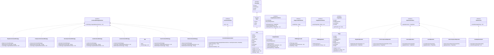

```mermaid
classDiagram
direction BT
class BrightenCommandStrategy {
  + BrightenCommandStrategy() 
  - validateArguments(String[]) String[]
  + run(String[], ImageDatabaseInterface) void
}
class BrightenOperation {
  + BrightenOperation(ImageState, int) 
  + applyOperation() ImageState
}
class ColorComponentOperation {
  + ColorComponentOperation(ImageState, String) 
  + applyOperation() ImageState
}
class CommandStrategyInterface {
<<Interface>>
  + run(String[], ImageDatabaseInterface) void
}
class ComponentCommandStrategy {
  + ComponentCommandStrategy() 
  - validateArguments(String[]) String[]
  + run(String[], ImageDatabaseInterface) void
}
class ControllerImplementation {
  + ControllerImplementation(ImageDatabaseInterface, ViewImplementation, Readable) 
  - listAllCommands() String
  + go() void
  - registerCommands() void
}
class ControllerInterface {
<<Interface>>
  + go() void
}
class IME {
  + IME() 
  + main(String[]) void
}
class IPixel {
<<Interface>>
   int green
   int blue
   int red
}
class IPixelState {
<<Interface>>
   int green
   int maxValue
   int blue
   int red
}
class Image {
  + Image(int, int, int) 
  - int width
  - int height
  - IPixel[][] pixelsList
  - int maxValue
  + setPixel(int, int, Pixel) void
  + getPixel(int, int) Pixel
   int width
   IPixel[][] pixelsList
   int maxValue
   int height
}
class ImageDatabase {
  + ImageDatabase() 
  + addImage(String, ImageState) void
  + removeImage(String) void
  + getImage(String) ImageState
   int numImages
   String allImageNames
}
class ImageDatabaseInterface {
<<Interface>>
  + getImage(String) ImageState
  + removeImage(String) void
  + addImage(String, ImageState) void
   int numImages
   String allImageNames
}
class ImageLoaderInterface {
<<Interface>>
  + load(String) Image
}
class ImageSaverInterface {
<<Interface>>
  + save(ImageState, String) void
}
class ImageState {
<<Interface>>
  + getPixel(int, int) Pixel
   int width
   IPixel[][] pixelsList
   int maxValue
   int height
}
class IntensityCommandStrategy {
  + IntensityCommandStrategy() 
  - validateArguments(String[]) String[]
  + run(String[], ImageDatabaseInterface) void
}
class IntensityOperation {
  + IntensityOperation(ImageState) 
  + applyOperation() ImageState
}
class LoadCommandStrategy {
  + LoadCommandStrategy() 
  - validateArguments(String[]) String[]
  + run(String[], ImageDatabaseInterface) void
}
class LumaCommandStrategy {
  + LumaCommandStrategy() 
  + run(String[], ImageDatabaseInterface) void
  - validateArguments(String[]) String[]
}
class LumaOperation {
  + LumaOperation(ImageState) 
  + applyOperation() ImageState
}
class OperationInterface {
<<Interface>>
  + applyOperation() ImageState
}
class PPMImageLoader {
  + PPMImageLoader() 
  - readImageParameters(Scanner) int[]
  + load(String) Image
}
class PPMImageSaver {
  + PPMImageSaver() 
  + save(ImageState, String) void
}
class Pixel {
  + Pixel(int, int, int) 
  + Pixel(int, int, int, int) 
  - int Blue
  - int Green
  - int Red
  - int maxValue
  + setAll(int, int, int) void
  + toString() String
   int Red
   int channel
   int Blue
   int maxValue
   int Green
}
class SaveCommandStrategy {
  + SaveCommandStrategy() 
  + run(String[], ImageDatabaseInterface) void
  - validateArguments(String[]) String[]
}
class ValueCommandStrategy {
  + ValueCommandStrategy() 
  + run(String[], ImageDatabaseInterface) void
  - validateArguments(String[]) String[]
}
class ValueComponentOperation {
  + ValueComponentOperation(ImageState) 
  + applyOperation() ImageState
}
class ViewImplementation {
  + ViewImplementation(Appendable) 
  + renderMessage(String) void
}
class ViewInterface {
<<Interface>>
  + renderMessage(String) void
}

BrightenCommandStrategy  ..>  CommandStrategyInterface 
BrightenOperation  ..>  OperationInterface 
ColorComponentOperation  ..>  OperationInterface 
ComponentCommandStrategy  ..>  CommandStrategyInterface 
ControllerImplementation  ..>  ControllerInterface 
IPixel  -->  IPixelState 
Image  ..>  ImageState 
ImageDatabase  ..>  ImageDatabaseInterface 
IntensityCommandStrategy  ..>  CommandStrategyInterface 
IntensityOperation  ..>  OperationInterface 
LoadCommandStrategy  ..>  CommandStrategyInterface 
LumaCommandStrategy  ..>  CommandStrategyInterface 
LumaOperation  ..>  OperationInterface 
PPMImageLoader  ..>  ImageLoaderInterface 
PPMImageSaver  ..>  ImageSaverInterface 
Pixel  ..>  IPixel 
SaveCommandStrategy  ..>  CommandStrategyInterface 
ValueCommandStrategy  ..>  CommandStrategyInterface 
ValueComponentOperation  ..>  OperationInterface 
ViewImplementation  ..>  ViewInterface 
```