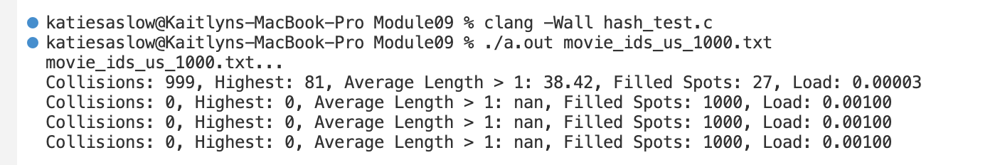

# Homework 09 - Hashmaps

Name: 
> Pranchal Shah

Github Account name: 
> cyber-shah

Link to Assignment on Github:
> 123

How many hours did it take you to complete this assignment (estimate)? 
> 7 hours

Did you collaborate with any other students/TAs/Professors? If so, tell us who and in what capacity.  
- one per row, add more if needed
  
  > TA : Abhijeet Chowdhury on timing hashmaps

Did you use any external resources (you do not have to cite in class material)? (Cite them below)  
- one row per resource

(Optional) What was your favorite part of the assignment? 

(Optional) How would you improve the assignment? 

## Questions

1. Add a markdown table demonstrating the in practice time for Hashmaps. 
 * Here is a markdown table that demonstrates the in practice time for Hashmaps.
 * N represents the size of the hashmap.
 * The time is in milliseconds.
  
| N | create | put | get | delete |
|---|--------|-----|-----|--------|
| 100 | 0.001000 | 0.001000 | 0.001000 | 0.001000 |
| 500 | 0.002000 | 0.001000 | 0.001000 | 0.001000 |
| 1000 | 0.003000 | 0.001000 | 0.001000 | 0.001000 |
| 5000 | 0.014000 | 0.001000 | 0.001000 | 0.001000 |
| 10000 | 0.025000 | 0.001000 | 0.001000 | 0.001000 |

As we can make out from the table, the time taken for each operation is constant. This is because the time complexity of each operation is O(1) and the hashing is very efficient. 
Moreover, one reason could also be that we are only adding and removing one element in each iteration and the hash table is not full.
   
1. What is the worst case time for a hashmap, even if rare, can you come up with a condition that always generates worst case?
   
   > A case where there would be worst case time complexity for hashmap is when there would be a collision on each key. This would result in a linked list of all the values for each key. This would result in a time complexity of O(n) for each operation.
2. Looking back at the Team Activity 09, how often did you see collisions from the various data sizes? (go ahead and copy/paste the output from the activity)
   
   
   .png)
   .png)

3. To make this hashmap fully usable - what are some functions missing that should be implemented? (props if you implement them!)
   * if you are stuck, think about how would someone get all the names of the food items, if they are doing inventory?
   > Some functions that are missing are:
   > 1. A function to print all the keys in the hashmap
   > 2. A function to print all the values in the hashmap
   > 3. A function to print all the key-value pairs in the hashmap

4. How can hashmaps help you with dynamic programming? Are they effective mechanisms for caches? 
   > Hashmaps are effective in finding items with a key in O(1) time. This way, the subproblems do not have to be solved again and again. This can be used to solve the fibonacci sequence problem.
   >  Hashmaps are effective mechanisms for caches as they can store the key-value pairs in a way that they can be accessed in O(1) time. This way, the cache can be accessed in O(1) time.