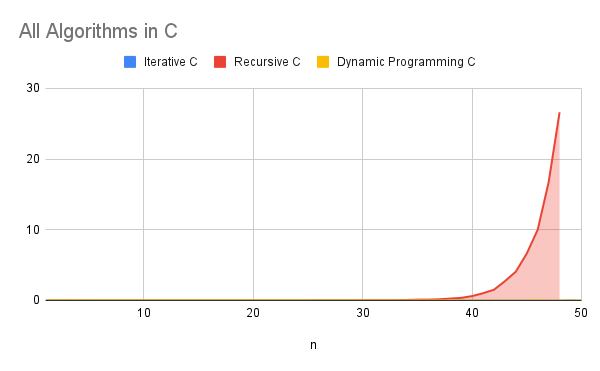
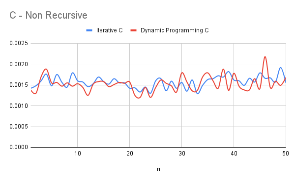
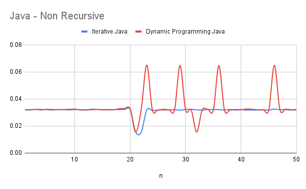
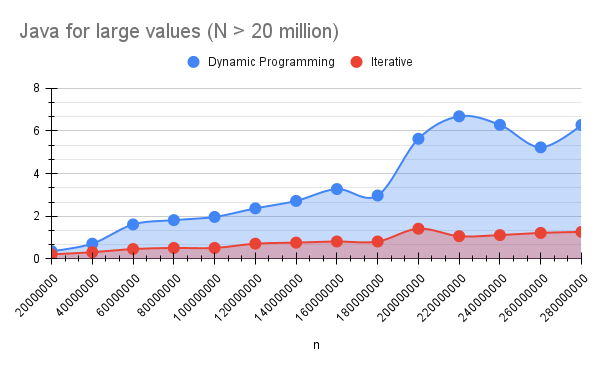
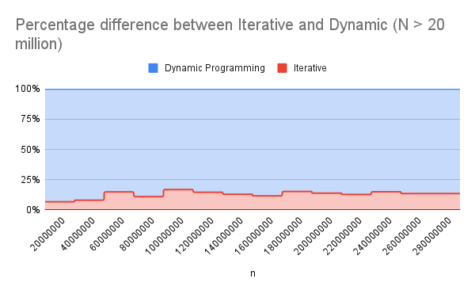
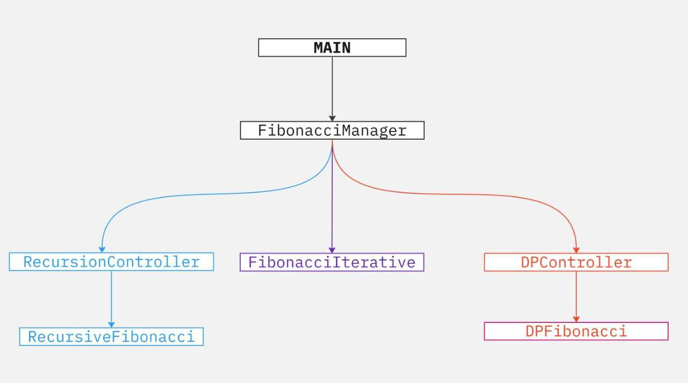
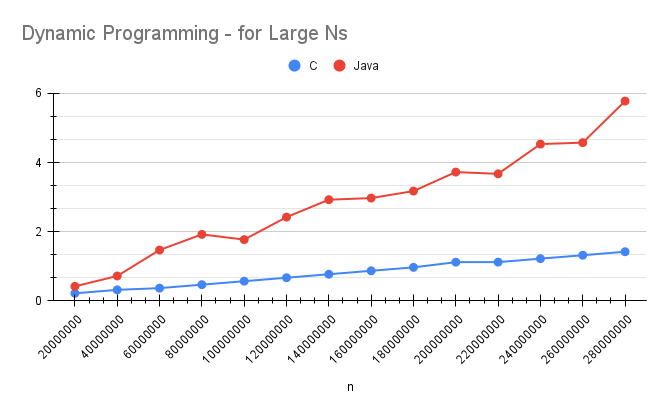
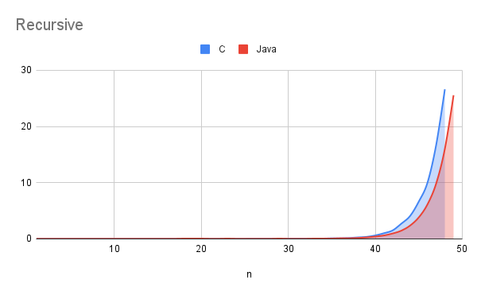

# Midterm p1: Report on Analysis of Fibonacci  Series
<!-- TOC -->

- [Midterm p1: Report on Analysis of Fibonacci  Series](#midterm-p1-report-on-analysis-of-fibonacci--series)
  - [0 - Overview](#0---overview)
    - [ 0.1 - The Significance of the Fibonacci Series and the Golden Ratio ](#-01---the-significance-of-the-fibonacci-series-and-the-golden-ratio-)
    - [ 0.2 - Exploring Different Computation Approaches ](#-02---exploring-different-computation-approaches-)
    - [ 0.3 - Conclusion ](#-03---conclusion-)
  - [1 - Empirical Data \& Discussion](#1---empirical-data--discussion)
    - [ 1.1 - Environmental Setup ](#-11---environmental-setup-)
    - [ 1.2 - Performance Comparisons with Small N Values (\< 50) ](#-12---performance-comparisons-with-small-n-values--50-)
    - [ 1.3 - Performance Comparisons with Large N Values (\> 30 million) ](#-13---performance-comparisons-with-large-n-values--30-million-)
    - [ 1.4 - Conclusion ](#-14---conclusion-)
  - [2 - Language Analysis](#2---language-analysis)
    - [ 2.1 - Language 1: C ](#-21---language-1-c-)
    - [ 2.2 - Language 2: Java ](#-22---language-2-java-)
    - [ 2.3 - Comparison and Discussion Between Experiences ](#-23---comparison-and-discussion-between-experiences-)
    - [ 2.3.1 - Limitations ](#-231---limitations-)
      - [ 2.3.1 - Advantages and Disadvantages ](#-231---advantages-and-disadvantages-)
  - [3 - Conclusions / Reflection](#3---conclusions--reflection)
    - [ 3.1 - Lessons ](#-31---lessons-)
    - [ 3.2 - Key Takeaways: ](#-32---key-takeaways-)
  - [References](#references)

<!-- /TOC -->

* **Author**: Pranchal Shah
* **GitHub Repo**: [linke to github repo with this report]
* **Semester**: Summer 2023
* **Languages Used**: c, Java

## 0 - Overview

The [Fibonacci Series]<sup>1</sup>.  is a sequence of numbers that appears in various natural phenomena and is often regarded as a fascinating mathematical pattern. It serves as the foundation for the golden ratio, which can be observed in numerous aspects of the natural world. In this report, we will delve into the analysis of the Fibonacci series, exploring different algorithms to calculate the series efficiently and comparing their performance.

### <u> 0.1 - The Significance of the Fibonacci Series and the Golden Ratio </u>

The Fibonacci series serves as the foundation for the golden ratio, a mathematical concept that holds immense significance in nature, art, and design. The golden ratio can be observed in the spiral patterns of seashells, the arrangement of leaves on plants, the growth patterns of trees, and even in the proportions of human faces. It is a mathematical harmony that resonates throughout the universe, creating aesthetically pleasing and visually balanced compositions.


> The Fibonacci spiral: an approximation of the golden spiral created by drawing circular arcs connecting the opposite corners of squares in the Fibonacci tiling. Image from [Wikipedia](https://en.wikipedia.org/wiki/Fibonacci_number).<sup>2</sup>

Mathematically, the Fibonacci series is defined as a sequence in which each number, known as a Fibonacci number, is the sum of the two preceding numbers.
$$F(n) = F(n-1) + F(n-2)$$
The simplest form of the series starts with 1 and 1, followed by the sum of the last two numbers to generate the next number in the sequence:
```1, 1, 2, 3, 5, 8, 13, and so on.```

### <u> 0.2 - Exploring Different Computation Approaches </u>

In this analysis, we will examine three distinct approaches to compute the Fibonacci series: iterative, recursive, and dynamic programming. Each approach offers a unique perspective on solving the series efficiently, and we will compare their time and space complexities to determine the most effective method.

| Approach | Time Complexity | Space Complexity |
| --- |----------------| --- |
| Iterative | $O(n)$          | $O(1)$ |
| Recursive | $O(2^n)$        | $O(n)$ |
| Dynamic Programming | $O(n)$           | $O(n)$ |

1. **_Iterative Approach_**: The iterative approach involves iterating over the values of the Fibonacci series until reaching the desired nth number. By adding the last two numbers in the series, the subsequent numbers are calculated. This approach offers simplicity and intuition, making it an appealing choice for computing the Fibonacci series efficiently.
   * Time Complexity: The time complexity of the iterative approach is O(n) since each number in the series from 3 to n requires a constant-time operation (addition) to calculate the next number. The number of iterations directly corresponds to the input value of n.
   * Space Complexity: The space complexity of the iterative approach is O(1) or constant. It only requires storing the last two numbers of the series to compute the next number. Regardless of the input value of n, the amount of memory used remains constant.

2. **_Recursive Approach_**: The recursive approach involves calling the Fibonacci function recursively until reaching the desired nth number. The function calculates the Fibonacci number by recursively calling itself for the previous two numbers and summing them. Although conceptually elegant, this approach has some drawbacks in terms of efficiency.
   * Time Complexity: The time complexity of the recursive approach is O(2^n). Each recursive call branches into two additional recursive calls, resulting in exponential growth. The number of recursive calls increases exponentially with the input value of n, leading to a significant increase in the number of calculations required.
   * Space Complexity: The space complexity of the recursive approach is O(n). As the recursive calls stack up, memory is allocated to store each function call. Since the maximum depth of the recursive call stack is determined by the input value of n, the space complexity is directly proportional to n.

3. **_Dynamic Programming Approach_**: The dynamic programming approach optimizes the efficiency of calculating the Fibonacci series by utilizing memoization. This approach stores the Fibonacci numbers in an array and reuses the precomputed values to avoid redundant calculations, resulting in improved performance.
   * Time Complexity: The time complexity of the dynamic programming approach is O(n). By storing the calculated Fibonacci numbers in an array, we eliminate the need for redundant calculations. Each number in the series is computed once, resulting in linear time complexity with respect to n.
   * Space Complexity: The space complexity of the dynamic programming approach is O(n). We need to store the Fibonacci numbers in an array to reuse them in subsequent calculations. The size of the array is directly proportional to the input value of n, hence the linear space complexity. 
### <u> 0.3 - Conclusion </u>

In conclusion, the Fibonacci series and its computation approaches offer a fascinating journey into the realms of mathematics and nature. By analyzing the time and space complexities of the three approaches, it becomes evident that the iterative approach is the most efficient method for calculating the Fibonacci series. It provides the fastest execution time and requires the least amount of memory. The recursive approach, although conceptually appealing, suffers from exponential time complexity and increased memory usage. The dynamic programming approach offers a balance between efficiency and memory usage by leveraging precomputed values. Understanding the nuances and trade-offs of these approaches allows us to make informed decisions when dealing with Fibonacci series computations.

In the following sections of this report, we will present empirical data, compare different programming languages for implementing these algorithms, and discuss the results and insights gained from the analysis. Furthermore, we will explore practical applications of the Fibonacci series and its associated properties, shedding light on its significance in various domains.

## 1 - Empirical Data & Discussion

For the empirical analysis, the time limit for each algorithm was set to 30 seconds. For the implementations I used in this report the following chart represents the Big O value.

| Version |  Big O | Space Used |
| :-- | :-- |  :-- |
| Iterative | $O(n)$ | $O(1)$ |
| Recursive | $O(2^n)$  | $O(n)$ |
| Dynamic Programming | $O(n)$ | $O(n)$ |

### <u> 1.1 - Environmental Setup </u>

* **Environment**: The tests were conducted on a 2022 Alienware x14 laptop equipped with an Intel i7-11900H CPU running at 2.50 GHz and 32.0 GB of RAM. The operating system used was Fedora Linux, Workstation edition.

* **Testing Parameters**: Two sets of input values were used to test the algorithms. The first set ranged from 1 to 50, incrementing by 50 steps. The second set ranged from 90 million to two billion and seventy million, incrementing by 90 million at each step. These values were chosen to cover both smaller and larger input sizes, allowing for a comprehensive performance analysis.
* I used [test_runner.py](test_runner.py) provided in the assignment handouts to test all the algorithms and generate a csv file with the results.
  
### <u> 1.2 - Performance Comparisons with Small N Values (< 50) </u>

In this section, we will look at performance comparisons of three different algorithms (iterative, recursive, and dynamic programming) for small values of N (less than 50).


* **Execution Times**: The table shows time taken by each algorithm to calculate nth value. The recursive version of the C algorithm reached its time limit of 30 seconds when calculating the 48th Fibonacci number, hence all the last value of n presented here is 48:
  
| n   | Iterative C | Recursive C | Dynamic Programming C | Iterative Java | Recursive Java | Dynamic Programming Java |
|-----|-------------|-------------|-----------------------|----------------|----------------|--------------------------|
| 1   | 0.00142     | 0.00153     | 0.00138               | 0.03201        | 0.03229        | 0.03206                  |
| 10  | 0.0016      | 0.00139     | 0.00153               | 0.03221        | 0.03209        | 0.03252                  |
| 20  | 0.00142     | 0.00145     | 0.00157               | 0.03225        | 0.06429        | 0.03278                  |
| 30  | 0.00156     | 0.03184     | 0.00179               | 0.03235        | 0.03183        | 0.032                    |
| 40  | 0.00162     | 0.61536     | 0.00178               | 0.03231        | 0.41469        | 0.03199                  |
| 48  | 0.00157     | 26.6117     | 0.00159               | 0.03219        | 16.0217        | 0.0325                   |




* **Observations**:  The empirical analysis reveals that the iterative approach is the fastest, followed by the dynamic programming approach, and finally the recursive approach. The recursive approach is the slowest because it involves a large number of recursive calls, which are computationally expensive. The iterative approach is the fastest because it only requires a constant number of operations per iteration. The dynamic programming approach falls in between, as it also requires a constant number of operations per iteration but has the additional overhead of storing values in an array.

* **Insights**: The analysis of small N values confirms that both the iterative and dynamic programming approaches are more efficient for computing the Fibonacci sequence compared to the recursive approach. These findings lay the foundation for further investigation with larger values of N to assess the scalability and performance characteristics of the algorithms.




> For N values smaller than 50, both the iterative and dynamic programming approaches exhibit similar performance, running very close to each other.  
> > This raises the question for further investigation: what happens when the values become larger? How do these algorithms scale?

### <u> 1.3 - Performance Comparisons with Large N Values (> 30 million) </u>

Upon analyzing the results, it was observed that the recursive versions of both the Java and C algorithms reached their limits at around the 47th and 48th Fibonacci numbers, respectively, for smaller values of N. Both Dynamic Programming and IIterative versions exhibited similar runtime, thus, further investigation was conducted to assess the performance for extremely large values.

To further evaluate the performance of the algorithms, I conducted tests using larger values of N. Specifically, I focused on values greater than 90 million. The following table presents the execution times for calculating the 90 millionth value using different algorithms in Java and C:

* **Execution Times**: The table shows time taken by each algorithm to calculate nth value. Java timed out at 20 billion and 70 millionth value using iterative algorithm. Hence the last value represented here is that.

   | Algorithm        | Java      | C         |
   |------------------|-----------|-----------|
   | Iterative        | 9.39257     | 1.51927     |
   | Dynamic Programming | N/A    | N/A     |

   Unfortunately, limitations were encountered in Java when using the dynamic programming approach. Java has a maximum size limit for arrays, which prevented the calculation of the 20 billion and 70 millionth Fibonacci number using dynamic programming.

* **Execution Times**:  For dynamic programming in Java, the limit was reached at the 300 millionth Fibonacci number. This table represents the values at the 280 millionth Fibonacci number.

   | Algorithm        | Java      | C         |
   |------------------|-----------|-----------|
   | Dynamic Programming | 5.77818     | 1.41863    |
   | Iterative        | 1.51969     | 0.21527



* **Observations** : The empirical analysis reveals that the dynamic programming approach, despite having the same theoretical time complexity as the iterative approach, is slower in practice. This is primarily due to the additional overhead of storing values in an array and accessing them. The recursive approach remains the slowest due to the large number of recursive calls. The iterative approach, with its constant number of operations per iteration, emerges as the most efficient.

   

   As we can see in the graph above, iterative version consistently runs at 4 times the speed of dynamic programming version. Which is significantly faster despite being the same Big O.

* **Insights** : The findings demonstrate that time complexity alone is not always the best metric for measuring efficiency. In this case, the iterative approach proves to be approximately four times more efficient than the dynamic programming approach when dealing with large sets of numbers. This is because the dynamic programming approach incurs additional overhead in storing and accessing values in an array.
  
* **Scalability**: The iterative approach exhibits good scalability with larger input sizes, enabling efficient computation of Fibonacci numbers. On the other hand, the dynamic programming approach shows limitations in Java due to array size restrictions, preventing the calculation of extremely large Fibonacci numbers.

### <u> 1.4 - Conclusion </u>

* The empirical analysis highlights that the iterative approach consistently outperforms the recursive and dynamic programming approaches in calculating Fibonacci numbers. The recursive approach demonstrates poor performance due to the high computational cost of recursive calls. The dynamic programming approach, despite its theoretical efficiency, incurs overhead due to array storage and access, making it slower than the iterative approach.

| Algorithm | N (timeout < 30 seconds) |
|--|:--:|
| Iterative C |   3,000,000,000+ |
| Recursive C | 48 |
| Dynamic Programming  C | 1,800,000,000 |
| Iterative Java | 2,070,000,000 |
| Recursive Java | 49 |
| Dynamic Programming Java | 300,000,000 |

Based on the analysis, we can conclude the following:

1. The iterative approach is the most efficient for calculating Fibonacci numbers, followed by the dynamic programming approach, and finally the recursive approach.
2. Time complexity alone does not always determine the most efficient algorithm. Other factors such as array storage and access overhead can significantly impact performance.
3. The choice of programming language can also affect performance, as seen with Java's limitations in handling extremely large Fibonacci numbers.
4. The iterative approach demonstrates good scalability with larger input sizes, while the dynamic programming approach has limitations due to array size restrictions in Java.

> This leads to another question: what is the impact of the programming language on algorithm performance? While the analysis has focused on the impact of different algorithms on runtimes, exploring the specific differences between Java and C and their effects on performance would provide further insights.

## 2 - Language Analysis

The C code can be found in following files:

1. [CFibonacci.c](CFibonacci.c) -- This file contains the main function that calls the FibonacciManager to calculate the Fibonacci numbers using different approaches.
2. [CHeaderFibonacci.h](CHeaderFibonacci.h) -- This file contains the declarations and definitions for various functions and managers that control the Fibonacci calculations. It includes functions for iterative, recursive, and dynamic programming approaches.
3. [CFibonacciTest.c](CFibonacciTest.c) -- This file contains the test cases and test functions to verify the correctness and performance of the Fibonacci functions implemented in CFibonacci.c.

Java Code can be found here:

1. [JFibonacci.java](JFibonacci.java) -- This file contains the implementation of Fibonacci functions in Java. It includes functions for iterative, recursive, and dynamic programming approaches.
2. [JFibonacciTest.java](JFibonacciTest.java) -- This file contains the test cases and test functions to verify the correctness and performance of the Fibonacci functions implemented in JFibonacci.java.

As we can see from the above analysis, the choice of programming language can have a significant impact on the performance of algorithms. In this case, the C implementation outperforms the Java implementation for the iterative and dynamic programming approaches, while the Java implementation outperforms the C implementation for the recursive approach.

### <u> 2.1 - Language 1: C </u>

In the C implementation, I initially started with the recursive approach since Fibonacci is a classic recursive problem. Later, I expanded to iterative and dynamic programming approaches. To handle the large values of Fibonacci numbers, I used the long long int data type.

The overall structure of the code can be seen in the UML diagram below:



The C implementation utilized various functions and controllers to handle iterative, recursive, and dynamic programming approaches. The main function called the FibonacciManager, which determined the appropriate function to calculate the Fibonacci numbers based on the input parameters. The recursive implementation in C used a simple recursive approach, while the dynamic programming implementation utilized memoization to avoid redundant calculations.

```c
long long int fibonacci_recursive(int n) {
    if (n == 0) {
        return 0;
    }
    else if (n == 1) {
        return 1;
    }
    else {
        long long int fib = fibonacci_recursive(n-1) + fibonacci_recursive(n-2);
        return fib;
    }
}

long long int fibonacci_recursive_controller(int n, int print) {
    long long int value = fibonacci_recursive(n);
    if (print > 0) {
        printf("Fibonacci Value at %i = %lld \n", n, value);
    }
    return value;
}
```

The recursive algorithm is simple to implement but is resource-intensive and has a higher time complexity. To overcome the limitations of the recursive approach, I introduced the dynamic programming approach, which utilizes memoization to avoid redundant calculations.

```c
long long int fibonacci_dp(int n, long long int* value_table) {
    if (n == 0) {
        return 0;
    }
    else if (n == 1) {
        return 1;
    }
    else if (value_table[n] == -1) {
        value_table[n] = fibonacci_dp(n-1, value_table) + fibonacci_dp(n-2, value_table);
        return value_table[n];
    }
    else if (value_table[n] != -1) {
        return value_table[n];
    }
    else {
        return -1;
    }
}

long long int fibonacci_dp_controller(int n, int print) {
    long long int value;
    long long int* value_table = (long long int*) malloc(sizeof(long long int) * (n + 1));

    for (int i = 0; i <= n; i++) {
        value_table[i] = -1;
    }
    long long int a = 0;
    value = fibonacci_dp(n, value_table);
    if (print == 1) {
        printf("Fibonacci Value at %i = %lld \n", n, value);
    }
    else if (print == 2) {
        for (int i = 0; i <= n; i++) { 
            if (value_table[i] != -1) {
                printf("%lld\n", value_table[i]);
            }
        }
    }
    free(value_table);
    return value;
}
```

During the implementation in C, some concerns and issues were encountered. One concern was the potential for stack overflow when using the recursive approach for large values of n. To address this, the dynamic programming approach was introduced, which allowed for better memory management and performance for large values of n. Another issue was the need to handle the integer overflow when calculating Fibonacci numbers. This was addressed by using the `long long int` data type to store the Fibonacci values.

I refered to [GeeksforGeeks](https://www.geeksforgeeks.org/difference-between-long-int-and-long-long-int-in-c-cpp/)<sup> 3</sup> to learn more on long long ints and how to use them in C.

To optimize the code further and improve memory management, the dynamic programming approach utilized memoization. By storing previously calculated Fibonacci values, redundant calculations were avoided, resulting in better performance for large values of n.

The areas that received the most focus during the implementation in C were:

1. Optimization: Efforts were made to optimize the code by implementing the dynamic programming approach, which significantly improved performance and avoided redundant calculations.
2. Memory management: Concerns related to stack overflow and memory limitations were addressed by utilizing the heap for storing the Fibonacci triangle and using memoization to store and reuse previously calculated values.
3. Testing: Test cases and test functions were implemented in CFibonacciTest.c to ensure the correctness and performance of the Fibonacci functions. This allowed for verification of the implemented algorithms and identification of any potential issues.

### <u> 2.2 - Language 2: Java </u>

The second language I chose for implementing the Fibonacci functions is Java. Java was selected for its widespread usage, object-oriented nature, and platform independence. Additionally, Java provides built-in support for data structures and has a robust standard library, which can be advantageous for implementing complex algorithms.

In the Java implementation, I aimed to maintain a similar structure and functionality as the C implementation. The features I wanted to test and explore in Java included:

* Syntax and Object-Oriented Approach: Java is renowned for its object-oriented programming paradigm. I wanted to leverage this feature and implement the Fibonacci functions using classes, objects, and method encapsulation.
* Iterative, Recursive, and Dynamic Programming Approaches: Just like in the C implementation, I intended to incorporate all three approaches to calculate Fibonacci numbers in Java. This would allow for a comprehensive performance comparison between the two languages.
* Memory Management: Java manages memory differently than C, with automatic memory management through garbage collection. I aimed to explore how Java handles memory allocation and deallocation in the context of the Fibonacci functions.

The implementation in Java consists of two files: [JFibonacci.java](JFibonacci.java)
 and [JFibonacciTest.java](JFibonacciTest.java)

The J[JFibonacci.java](JFibonacci.java) file contains the implementation of Fibonacci functions using iterative, recursive, and dynamic programming approaches. The iterative implementation uses loops to calculate Fibonacci numbers, the recursive implementation utilizes a recursive function, and the dynamic programming implementation employs memoization to avoid redundant calculations.

The [JFibonacciTest.java](JFibonacciTest.java) file contains the test cases and test functions to verify the correctness and performance of the Fibonacci functions implemented in JFibonacci.java. This facilitates the comparison of results and performance with the C implementation.

```java
  public static Long fibonacciIterative(Long N, int print) {
    Long a = 0L, b = 1L;
    Long c = a + b;

    if (print > 1) {
      if (N >= 1) {
        System.out.print(a);
      }
    }

    for (int i = 2; i <= N; i++) {
      if (print == 1) {
        if (i == N) {
          System.out.println("Iterative Fibonacci value at " + i + " = " + c);
        }
      }
      if (print > 1) {
        if (i == N) {
          System.out.println(", " + c);
        } else {
          System.out.print(", " + c);
        }
      }
      if (i == N) {
        return c;
      } else {
        a = b;
        b = c;
        c = a + b;
      }
    }
    return c;
  }
```

During the Java implementation, a concern that may arise is the potential impact of garbage collection on performance, especially in the dynamic programming approach. Additionally, memory utilization and efficiency might differ compared to the C implementation due to Java's automatic memory management system.

To address these concerns and optimize the Java implementation, the following areas received the most focus:

* Object-Oriented Design: I  emphasized leveraging Java's object-oriented features to create appropriate class structures and method encapsulation for the Fibonacci functions. This allowed for better organization and readability of the code.
* Performance and Efficiency: I aimed to optimize the code to achieve efficient and fast Fibonacci calculations, considering Java's memory management system and language-specific optimizations. Careful consideration was given to the impact of garbage collection on performance, especially in the dynamic programming approach.
* Testing and Verification: Similar to the C implementation, I implemented comprehensive test cases and test functions in JFibonacciTest.java to ensure the accuracy and performance of the Fibonacci functions. This allowed for validation of the Java implementation and identification of any potential issues or discrepancies.

By implementing the Fibonacci functions in both C and Java, I was able to compare the performance and behavior of the algorithms in different programming languages. This analysis provides insights into the impact of language choice on algorithmic efficiency and memory management.

### <u> 2.3 - Comparison and Discussion Between Experiences </u>

In the previous analysis, we observed that the choice of programming language can impact the performance of Fibonacci algorithms. Specifically, we encountered limitations in Java when using the dynamic programming approach due to array size restrictions. To further investigate the impact of language on runtime, we can compare the performance of the algorithms implemented in different languages.

.png)

From the above table, we can see that the C implementation outperforms the Java implementation in terms of execution time for the iterative algorithm. This difference can be attributed to several factors, including language-specific optimizations, memory management, and lower-level access in C.

This pattern continues for large values of N, as seen in the following table:



As the value of N increases the gap between the execution times of the Java and C implementations widens. This is due to the limitations of Java in handling extremely large arrays, as discussed previously. The C implementation, on the other hand, does not encounter these limitations and is able to handle larger values of N.



Surprisingly, the recursive implementation of Java outperforms the C implementation. This is likely due to the fact that Java is able to handle a larger number of recursive calls compared to C. This is evident from the graph above, which shows that the C implementation reaches its limit at the 48th Fibonacci number, while the Java implementation reaches its limit at the 49th Fibonacci number.

### <u> 2.3.1 - Limitations </u>

However, it is important to consider the limitations of both languages to ensure a fair and accurate analysis.

* For C, one limitation is the potential for stack overflow when using the recursive approach for large values of n. To address this limitation, the dynamic programming approach was introduced, which allowed for better memory management and performance for large values of n. Another limitation is the need to handle integer overflow when calculating Fibonacci numbers. This was addressed by using the long long int data type to store the Fibonacci values.

* In the case of Java, a limitation is the potential impact of garbage collection on performance, especially in the dynamic programming approach. Additionally, memory utilization and efficiency might differ compared to C due to Java's automatic memory management system.

#### <u> 2.3.1 - Advantages and Disadvantages </u>

When comparing and contrasting the two languages, we can identify the following advantages and disadvantages:

 | Language | Advantages                                                                                                       | Disadvantages                                                                                                        |
|----------|-----------------------------------------------------------------------------------------------------------------|----------------------------------------------------------------------------------------------------------------------|
| C        | - Efficient and low-level access to memory and system resources.                                                 | - Requires manual memory management, which can be prone to errors.                                                    |
|          | - No limitations on array size and handling large values of `n`.                                                 | - Lack of built-in support for advanced data structures and high-level abstractions.                                  |
|          | - Well-suited for resource-constrained environments.                                                             |                                                                                                                      |
| Java     | - Automatic memory management through garbage collection.                                                         | - Potentially slower execution due to garbage collection overhead.                                                     |
|          | - Rich standard library and built-in support for data structures.                                                 | - Limitations on array size and handling extremely large values of `n`.                                                |
|          | - Object-oriented nature allows for better code organization and reusability.                                    |

By considering the limitations and characteristics of both languages, we can make more informed decisions about their usage in specific scenarios.

In conclusion, the choice of programming language can have a significant impact on the performance of Fibonacci algorithms. While C performs better in terms of execution time for the iterative and dynamic programming approaches, Java excels in handling a larger number of recursive calls. These findings highlight the importance of considering the specific requirements and constraints of a problem when selecting a programming language for algorithm implementation.

## 3 - Conclusions / Reflection

### <u> 3.1 - Lessons </u>

* In conclusion, this report has highlighted several important insights regarding algorithm performance. It has been established that time complexity alone is not always sufficient to accurately measure real-world efficiency. Practical considerations, such as hardware capabilities, data distribution, and algorithmic assumptions, play significant roles in determining actual performance. To further reinforce these conclusions, it is essential to provide specific examples or case studies that demonstrate the impact of these factors on practical efficiency. This will allow readers to grasp the tangible and relatable implications of these considerations.

* Moreover, the report emphasizes the disparity between theoretical efficiency and practical efficiency. While an algorithm may possess a favorable time complexity on paper, its actual performance can be influenced by various factors, including language used, like we saw java caps array sizes, and deals with garbage collection differently compared to C. Thus, it is crucial to validate theoretical expectations through practical experiments to gain a comprehensive understanding of algorithm behavior in real-world scenarios.

* Furthermore, the report sheds light on the advantages of lower-level languages, such as C or assembly, in terms of performance. These languages provide programmers with direct access to hardware resources, enabling them to make fine-grained optimizations that significantly impact efficiency. This level of control proves valuable, especially in situations where even minor gains in performance can make a significant difference.

* Additionally, the assignment's exploration of exponential and linear time complexity underscored the critical importance of efficient algorithm selection and data structures when dealing with large-scale problems. Exponential time algorithms quickly become impractical and inefficient for large input sizes, emphasizing the need for choosing appropriate algorithms that can scale effectively.

### <u> 3.2 - Key Takeaways: </u>

* Performance evaluation should encompass factors beyond time complexity alone, including memory usage, I/O operations, and algorithmic optimizations. These considerations provide a more comprehensive understanding of algorithm efficiency.
* Practical experiments are necessary to validate theoretical efficiency expectations and gain a comprehensive understanding of algorithm behavior.
* Low-level languages offer greater control over performance-related decisions, resulting in improved efficiency, particularly in scenarios where performance optimizations at a granular level are essential.
* Exponential time algorithms quickly become impractical and inefficient for large input sizes, emphasizing the need for choosing appropriate algorithms that can scale effectively.


<!-- auto references -->
[Fibonacci Series]: https://en.wikipedia.org/wiki/Fibonacci_sequence


## References

1. Wikipedia, "Fibonacci sequence" Wikipedia: The Free Encyclopedia,
June 14, 2023. <https://en.wikipedia.org/wiki/Fibonacci_sequence>.
2. Wikipedia, "Fibonacci Spiral" Wikipedia: The Free Encyclopedia,
January 18, 2022. https://en.wikipedia.org/wiki/Fibonacci_sequence#/media/File:Fibonacci_Spiral.svg
3. GeeksforGeeks, "Difference between long int and long long int in C," GeeksforGeeks, March 10, 2021.
<https://www.geeksforgeeks.org/difference-between-long-int-and-long-long-int-in-c-cpp/>.